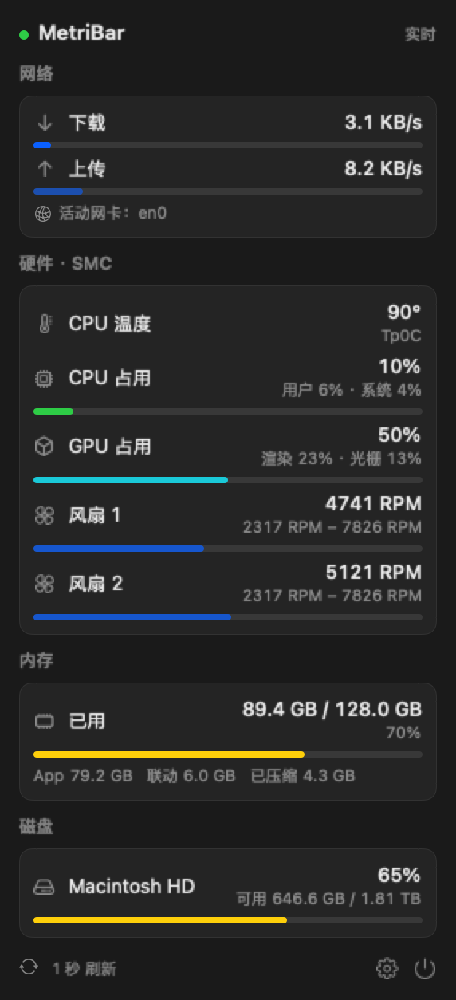
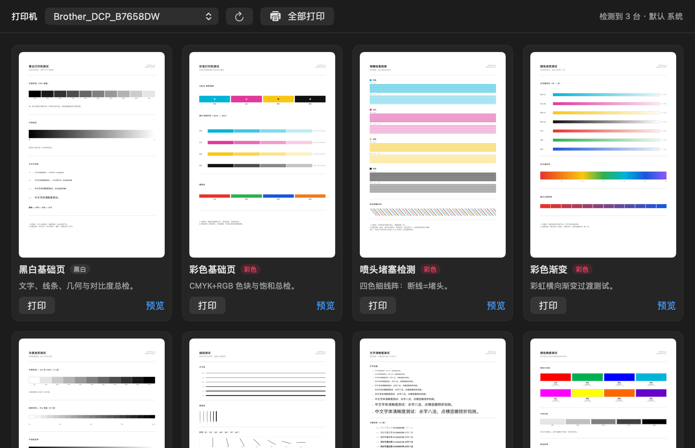
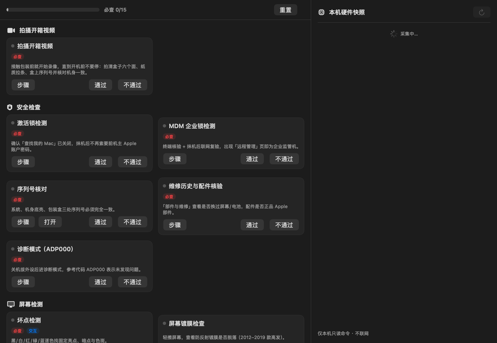
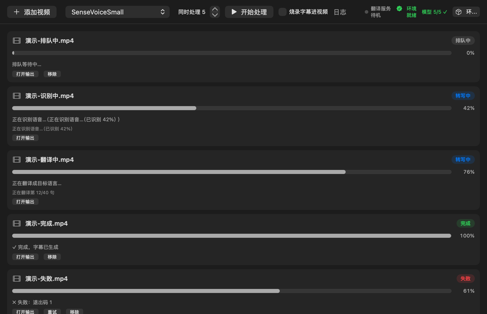
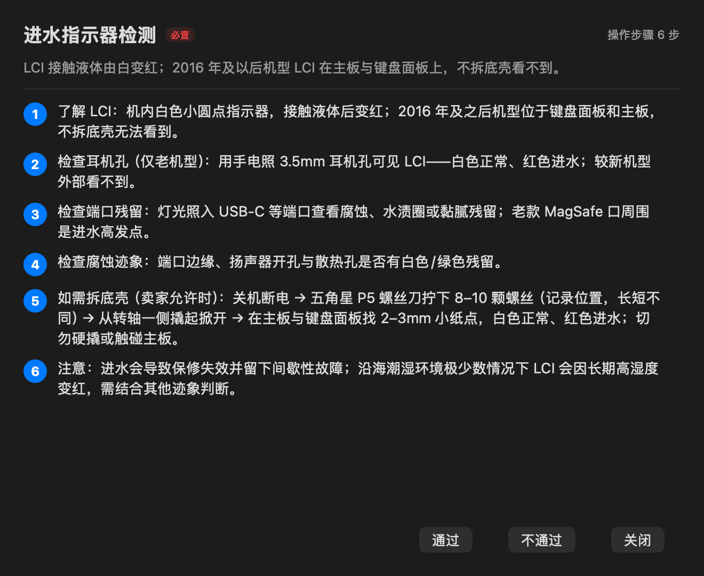
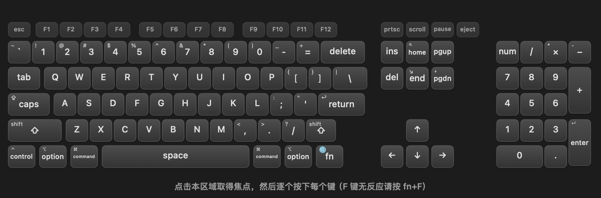
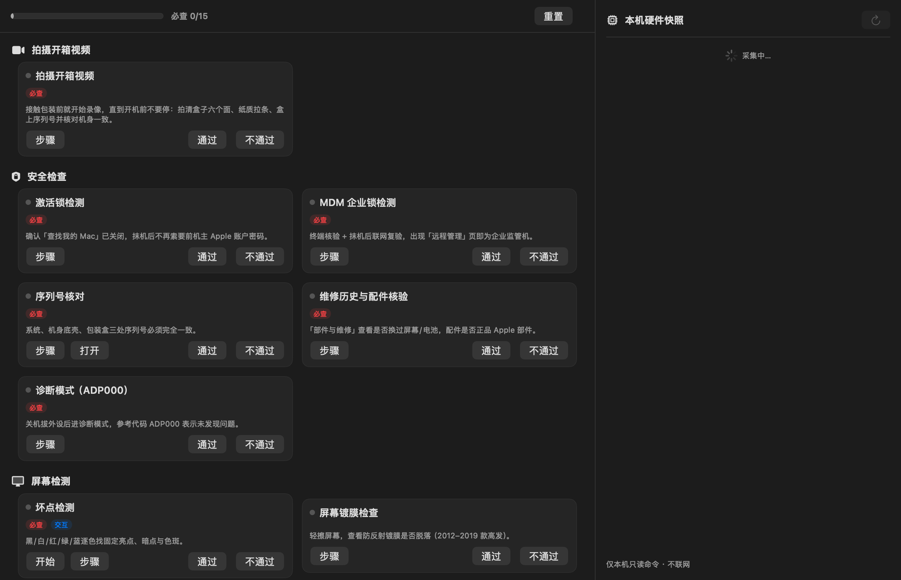
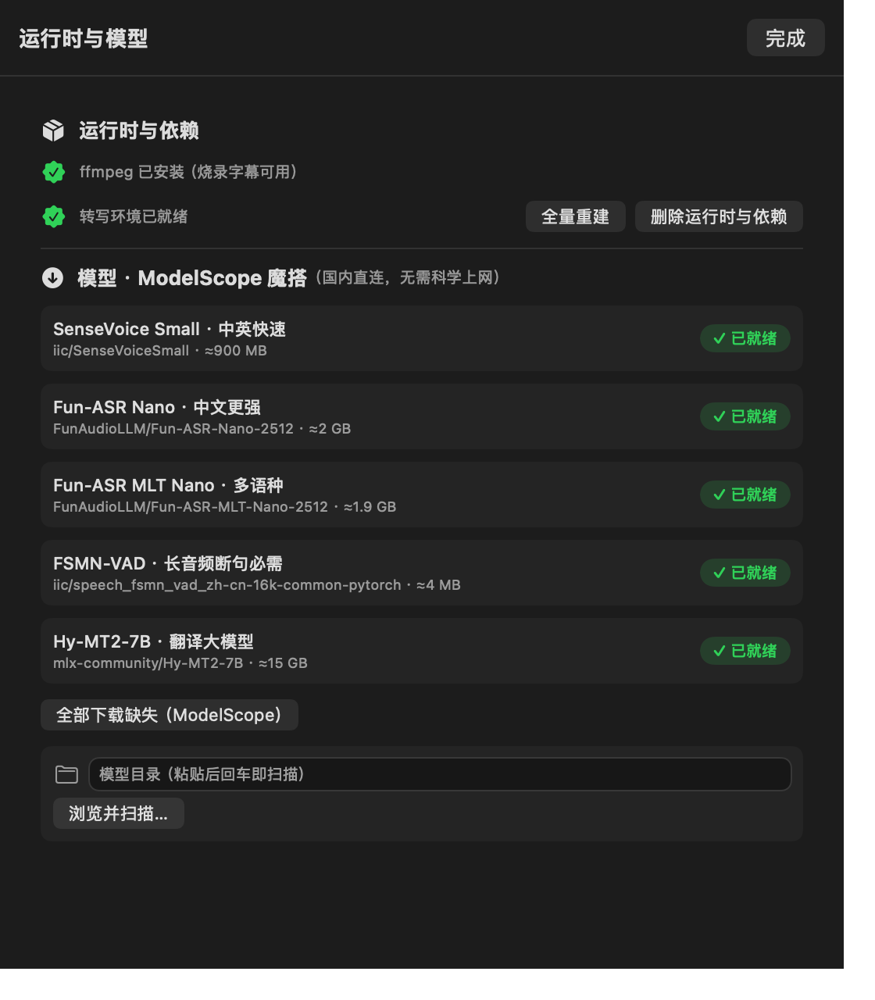
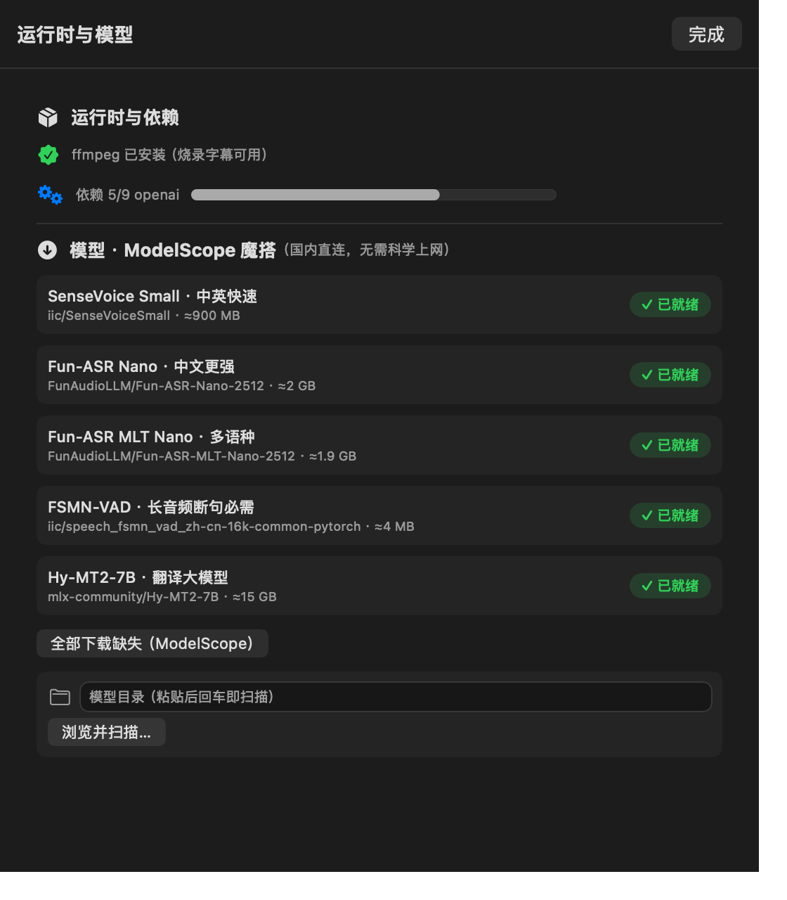

# MetriBar 🌡️🧰

**Real-time macOS menu-bar monitor + a three-in-one toolbox**: see `↓down ↑up CPU-temp ♥heart-rate` right in the menu bar, click for network/CPU/GPU/fan/memory/disk, and open a separate toolbox window with **Printer Test · MacBook Inspection · Video Translation**.

Built purely with **SwiftUI `MenuBarExtra(.window)`** — not a single line of AppKit `NSStatusItem`; no network requests, no telemetry, no cloud sync, **fully offline and read-only**.

<div align="center">

[简体中文 (README.md)](README.md) · **English**

`v2.0` · `com.qyx.MetriBar` · macOS 13.0+ · MIT

</div>

---

## 📑 Table of Contents

- [1. Overview](#1-overview)
  - [1.1 What it is](#11-what-it-is) · [1.2 Capabilities](#12-capabilities) · [1.3 Use cases](#13-use-cases) · [1.4 Tech stack](#14-tech-stack) · [1.5 Version info](#15-version-info)
- [2. Environment & Dependencies](#2-environment--dependencies)
  - [2.1 Runtime requirements](#21-runtime-requirements) · [2.2 Development](#22-development) · [2.3 Prerequisites](#23-prerequisites) · [2.4 Installation](#24-installation) · [2.5 Environment variables](#25-environment-variables) · [2.6 Data directories](#26-paths-and-data-directories) · [2.7 One-click transcription environment](#27-one-click-transcription-environment)
- [3. Project Structure](#3-project-structure)
- [4. Core Modules](#4-core-modules)
  - [4.1 Collectors & menu bar](#41-collectors--menu-bar) · [4.2 Printer test](#42-printer-test) · [4.3 MacBook inspection](#43-macbook-inspection) · [4.4 Video translation](#44-video-translation) · [4.5 In-app UI test harness](#45-in-app-ui-test-harness)
- [5. Build, Deploy & Run](#5-build-deploy--run)
- [6. User Guide](#6-user-guide)
- [7. Operations & Extension](#7-operations--extension) (incl. [7.8 Language support](#78-language-support))
- [8. License & Author](#8-license--author)
- [9. Screenshots](#9-screenshots)
- [Appendix A · Changelog](#appendix-a--changelog) · [Appendix B · Reference Docs](#appendix-b--reference-docs)

---

## 1. Overview

### 1.1 What it is

MetriBar is a **macOS menu-bar system monitor** that, since v2.0, also ships three everyday tools inside the same app:

| Aspect | Detail |
| --- | --- |
| Shape | An `LSUIElement = true` agent app: **no Dock icon, no main window** — it lives in the menu bar |
| Value | ① Metrics **always visible without opening anything**; ② three tools that run **fully locally** and upload nothing |
| Engineering bottom lines | Collectors run off the main thread; models **unload when the process ends**; the transcription environment **never touches system Python**; every system read is read-only |
| Distribution | Signed dmg, external distribution (reading AppleSMC requires disabling App Sandbox, so the Mac App Store is impossible) |

### 1.2 Capabilities

| Module | Highlights |
| --- | --- |
| **Menu bar** | Down/up throughput, CPU temperature (with sensor key), CPU/GPU utilization, watch heart rate ♥; two layouts (rich/compact); digits that do not jitter |
| **Popover** | Up/down rates + ratio bar, CPU temperature & sensor, CPU/GPU utilization, fan RPM and range, memory (App/Wired/Compressed), disk free space, heart-rate status |
| **🖨 Printer Test** | `lpstat` enumerates CUPS printers (default marked); **9 A4 test pages drawn on the fly with Core Graphics**: preview / print one / batch "3 common pages" |
| **🔍 MacBook Inspection** | **32 items across 10 sections, 15 must-check, 8 FAQs**, each with step-by-step guidance; interactive tests (dead pixels, full keyboard, trackpad canvas, stereo sweep, mic record/playback, camera preview); **local hardware snapshot** (serial, full battery details, MDM enrollment, disk SMART) |
| **🎬 Video Translation** | Local FunASR + FSMN-VAD transcription → LLM translation → bilingual subtitles → optional ffmpeg burn-in; **one Python subprocess per task, models unloaded the moment it exits**; model dir / Python / translation endpoint / concurrency all configurable |
| **Model management** | 5 models downloaded straight from ModelScope; byte-weighted progress; pause / resume (HTTP range) / stop (delete cache); `.metribar_ok.json` integrity marker plus per-file size verification against the official manifest |
| **Environment bootstrap** | One click: standalone CPython runtime (npmmirror) + venv + 9 dependencies (Tsinghua mirror), every step logged |
| **Quality built in** | `Scripts/selftest.sh` gates every release (9 sections); an in-app **UI test harness** (`--uitest`, 23 cases + 15 real screenshots) |

### 1.3 Use cases

- **Ambient monitoring**: glance at throughput, temperature and utilization while downloading, compiling or gaming.
- **Sports data on screen**: enable "heart rate broadcast" on a Garmin (or any BLE HR device) and read it in the menu bar — standard BLE service, no vendor SDK.
- **Buying/selling a used Mac**: work through the inspection checklist, run the interactive tests on the spot, keep the hardware snapshot as evidence.
- **Printer acceptance & maintenance**: after installing a printer or swapping a cartridge, print the test set to check nozzles, registration and color.
- **Offline video subtitling**: batch-produce Chinese or bilingual subtitles for interviews, lectures and meeting recordings without the footage ever leaving the machine.

### 1.4 Tech stack

| Layer | Technology | Purpose |
| --- | --- | --- |
| UI | SwiftUI (`MenuBarExtra(.window)`, `HSplitView`, `LazyVGrid`, `ImageRenderer`) | Menu bar, popover, toolbox tabs |
| AppKit glue | `NSWindow`, `NSHostingController`, `NSOpenPanel`, `NSPanel`, `NSTextField` | Settings/toolbox/full-screen/overlay windows, directory pickers |
| Drawing | Core Graphics + `NSAttributedString` (Core Text) | Non-template menu-bar bitmap badge, 9 print test pages (PDF), realistic keyboard canvas |
| System reads | `sysctl` / `host_statistics*` / `getifaddrs` / IORegistry / AppleSMC | CPU, memory, NIC byte counters, GPU, temperature & fans |
| Sensors | [SMCKit](https://github.com/srimanachanta/SMCKit) `1.1.0` (MIT) | AppleSMC temperature and fan RPM |
| Wireless | CoreBluetooth (BLE central, service `0x180D` / characteristic `0x2A37`) | Watch heart rate |
| Media | AVFoundation (`AVAudioRecorder`/`AVAudioPlayer`/`AVCaptureVideoPreviewLayer`) | Mic record & playback, camera preview |
| Transcription sidecar | Python 3.11 (standalone runtime) + FunASR + FSMN-VAD + `mlx-lm` + `openai` + `opencc` | ASR, translation, bilingual subtitle merging |
| Burn-in | ffmpeg / ffprobe (system or Homebrew, optional) | Hard-burned subtitles |
| Build & ship | `xcodebuild` + `hdiutil` + `codesign` (optional `notarytool`) | Archive, sign, dmg, notarize |
| Quality | Bash self-test script + in-app UI harness (`--uitest`) | Release gate and UI regression |

### 1.5 Version info

| Item | Value |
| --- | --- |
| Version / build | `MARKETING_VERSION = 2.0`, `CURRENT_PROJECT_VERSION = 10` |
| Bundle ID | `com.qyx.MetriBar` |
| Minimum OS | `MACOSX_DEPLOYMENT_TARGET = 13.0` |
| Swift language mode | `SWIFT_VERSION = 5.0` (`SWIFT_DEFAULT_ACTOR_ISOLATION = nonisolated`; the UI layer is explicitly `@MainActor`) |
| Releases | <https://github.com/QinyiXiong/MetriBar/releases/tag/v2.0> |
| Release assets | `MetriBar-2.0.dmg`, `MetriBar-2.0-Test-Report.docx` |
| License | MIT (see [section 8](#8-license--author)) |
| UI language | **Chinese only** — see [7.7](#77-known-gaps-and-fixes-in-this-round) |

---

## 2. Environment & Dependencies

### 2.1 Runtime requirements

| Item | Requirement | Notes |
| --- | --- | --- |
| OS | **macOS 13.0 Ventura or later** | `SMAppService` (login item) and `MenuBarExtra` need 13+ |
| CPU | Apple Silicon and Intel both supported | Temperature sensor key lists adapt per platform; the **one-click transcription runtime is aarch64-only** (see 2.7) |
| Permissions | Bluetooth (heart rate), Microphone/Camera (inspection tests, on demand) | Denying them still leaves every other feature working |
| Disk | ≈ 3.4 MB for monitoring | The transcription chain needs ≈ 2.2 GB (runtime 62 MB + venv ≈ 1.6 GB) plus ≈ 19 GB of models |

> ⚠️ **App Sandbox must be disabled**: CPU temperature and fan RPM come from the AppleSMC user client, which cannot open its `io_service` inside a sandbox.
> The project sets `ENABLE_APP_SANDBOX = NO`, and `MetriBar.entitlements` contains only `com.apple.security.app-sandbox = false`.
> Consequence: dmg-only external distribution — **no Mac App Store**.

### 2.2 Development

- **Xcode 15+** (developed and verified on Xcode 26/27 with the Swift 6 toolchain; the project uses language mode 5.0)
- SwiftPM dependency: `SMCKit`, **pinned to exact version `1.1.0`**, recorded in `MetriBar.xcodeproj/project.xcworkspace/xcshareddata/swiftpm/Package.resolved`

```bash
# if packages did not resolve automatically
xcodebuild -resolvePackageDependencies -project MetriBar.xcodeproj -scheme MetriBar
```

> Why `srimanachanta/SMCKit`: upstream `beltex/SMCKit` ships no `Package.swift` and cannot be resolved by SwiftPM; this fork adds the manifest, stays MIT and keeps the same API (`SMCKit.shared`, `read<V: SMCCodable>(_:)`, `FourCharCode`, `allKeys()`).
> For offline/intranet use, clone it to `Packages/SMCKit` and use **Add Local…** — no source changes needed.

### 2.3 Prerequisites

| Dependency | Required? | Notes |
| --- | --- | --- |
| `ffmpeg` / `ffprobe` | **Optional** | Only needed when "burn subtitles into video" is enabled. Detected through a **login shell** (`/bin/bash -lc "command -v ffmpeg"`), covering Homebrew `ffmpeg`, `ffmpeg-full`, conda and MacPorts installs; the result is cached (`translate.ffmpegPath`). Without it, burn-in is blocked up front with a `brew install ffmpeg` hint |
| Python 3.11 runtime + venv | **Automatic** | The app's `install_runtime.sh` downloads the runtime, creates the venv and installs dependencies — **system Python is never touched** (see 2.7) |
| ASR / translation models | On demand | 5 models download straight from ModelScope in the Environment panel (see 6.5) |
| CUPS printer | Needed for Printer Test | Enumerated via `lpstat`, jobs submitted with `lp` |

### 2.4 Installation

**A. From source (development)**

```bash
git clone https://github.com/QinyiXiong/MetriBar.git
cd MetriBar
open MetriBar.xcodeproj          # pick the MetriBar scheme → Run
```

**B. Command line (no developer account, ad-hoc signing)**

```bash
xcodebuild -project MetriBar.xcodeproj -scheme MetriBar -configuration Release \
  -derivedDataPath ../.DerivedData CODE_SIGN_IDENTITY="-"
open ../.DerivedData/Build/Products/Release/MetriBar.app
```

**C. From the dmg (end users)**

```bash
hdiutil attach dist/MetriBar-2.0.dmg     # or double-click
cp -R /Volumes/MetriBar/MetriBar.app /Applications/
xattr -dr com.apple.quarantine /Applications/MetriBar.app   # only needed for un-notarized builds (see 5.4)
open /Applications/MetriBar.app
```

The app takes **no Dock slot** and appears in the menu bar. "Launch at login" is a single toggle in Settings (`SMAppService`, no plist), and it self-heals the login item to point at `/Applications`.

### 2.5 Environment variables

Every variable is **injected into the child process by the app**; you can also export them yourself when running the scripts by hand (the scripts stay backward compatible when they are unset).

| Variable | Injected by | Purpose | Default / value |
| --- | --- | --- | --- |
| `METRIBAR_MODEL_DIR` | App | Model root directory | The script falls back to its sibling `models/` |
| `METRIBAR_SENSEVOICE_DIR` | App | SenseVoiceSmall directory (supports `publisher/model` nesting) | The script resolves it itself when empty |
| `METRIBAR_NANO_DIR` | App | Fun-ASR-Nano-2512 directory | Same |
| `METRIBAR_MLT_NANO_DIR` | App | Fun-ASR-MLT-Nano-2512 directory | Same |
| `METRIBAR_VAD_DIR` | App | FSMN-VAD directory | Same |
| `METRIBAR_TRANSLATE_BASE_URL` | App | Translation endpoint (OpenAI-compatible) | App default `http://127.0.0.1:18888/v1` |
| `METRIBAR_TRANSLATE_API_KEY` | App | Endpoint API key | Injected only when non-empty |
| `METRIBAR_TRANSLATE_MODEL` | App | Model id — the app injects the **absolute path of Hy-MT2-7B** | The endpoint routes by `model`; a wrong value returns HTTP 400 |
| `METRIBAR_TRANSLATE_CONCURRENCY` | App | Translation request concurrency | Dynamically shared: `max(2, 8 / activeTasks)` so parallel tasks cannot flood the endpoint |
| `METRIBAR_JSON_PROGRESS` | App | `1` makes the script emit one JSON progress object per line | Unset → plain-text log only |
| `PYTHONUNBUFFERED` | App | `1`, so progress lines arrive immediately | — |
| `PATH` | App | Prepends `/opt/homebrew/bin:/opt/homebrew/opt/ffmpeg-full/bin:/usr/local/bin` | Lets the scripts find ffmpeg |

### 2.6 Paths and data directories

| Path | Contents |
| --- | --- |
| `~/Library/Application Support/MetriBar/` | App data root (`ToolPaths.supportDir`) |
| ├─ `runtime/` | Standalone CPython runtime (`runtime/python/bin/python3`, ≈ 62 MB) |
| ├─ `env/` | Transcription virtualenv (`env/bin/python3`, ≈ 1.6 GB) |
| ├─ `models/` | Default model directory (configurable) |
| ├─ `install_runtime.sh` | Cached copy of the build script (shipped in the bundle, handy for manual reruns) |
| └─ `logs/MetriBar.log` | File read by the in-app Log popover (**deleted once you close it**, see 7.1) |
| Bundle `Contents/Resources/pipeline/` | `transcribe.py`, `embed_subtitle.py` (usable as the default pipeline directory) |
| Bundle `Contents/Resources/TestPages/` | The 9 original print test PDFs (byte-identical to `Vendor/TestPages`, verified by the self-test) |
| `~/Library/Logs/DiagnosticReports/` | System crash reports (the self-test checks for crashes in the last hour) |
| `dist/MetriBar-<version>.dmg` | Packaging output |

### 2.7 One-click transcription environment

Clicking **Build environment** in the Environment panel (or running the bundled script by hand) executes this fixed sequence, logging every step with a timestamp:

| Step | Action | Failure behaviour |
| --- | --- | --- |
| STEP1 | `curl -fL --retry 3` downloads standalone CPython: `https://registry.npmmirror.com/-/binary/python-build-standalone/20250918/cpython-3.11.13%2B20250918-aarch64-apple-darwin-install_only.tar.gz` | `FAIL STEP1 下载失败` → exit 1 |
| STEP2 | Extracts into the data directory, renames the tar's `python/` to `runtime/`, verifies `runtime/bin/python3` | `FAIL STEP2 …` → exit 1 |
| STEP3 | `runtime/bin/python3 -m venv env` | `FAIL STEP3 venv失败` → exit 1 |
| STEP4 | Clears the real macOS pip cache (`~/Library/Caches/pip`) and installs each package (`--no-cache-dir`, Tsinghua mirror `https://pypi.tuna.tsinghua.edu.cn/simple`) | Any package fails → `FAIL <name>` → exit 1 |
| STEP5 | `import funasr, torch, mlx_lm, openai, soundfile, opencc` | `FAIL import验证` → exit 1 |

The 9 packages of STEP4, in install order: `funasr==1.4.1`, `torch`, `torchaudio`, `mlx-lm`, `openai`, `opencc-python-reimplemented`, `soundfile`, `python-multipart`, `librosa`.
Only `funasr` is version-pinned; **`mlx-lm` and `mlx` must share the same major version** (a mismatch makes concurrent decoding hang; the self-test compares the majors on the real venv).

> Progress display: the app parses the script output (`STEP*`, `依赖 N/9`) into 0–100 %: runtime 10 %, venv 28 %, dependencies 35→95 %, verification 96 %, done 100 % — and it **only moves forward**.

---

## 3. Project Structure

```
MetriBar/
├── MetriBar.xcodeproj/                 # Xcode project (SMCKit 1.1.0 pinned in Package.resolved)
├── MetriBar.entitlements               # only app-sandbox=false
├── MetriBar/                           # App sources (Swift, 27 files ≈ 7,939 lines)
│   ├── MetriBarApp.swift               # @main: MenuBarExtra(.window) + debug/harness entry points
│   ├── UITestHarness.swift             # In-app UI harness (--uitest: drives views, captures, asserts)
│   ├── Info.plist                      # Hand-written Info.plist (LSUIElement, usage strings, version placeholders)
│   ├── Model/                          # ① Collectors (fully decoupled from the UI, never on the main thread)
│   │   ├── MetricsSnapshot.swift       # Immutable value-type snapshot
│   │   ├── MetricsEngine.swift         # DispatchSourceTimer scheduler + @MainActor MetricsStore
│   │   ├── NetworkCollector.swift      # getifaddrs + if_data, NIC whitelist, Δ→bytes/s
│   │   ├── CPULoadCollector.swift      # host_statistics(HOST_CPU_LOAD_INFO) tick deltas
│   │   ├── MemoryCollector.swift       # host_statistics64(HOST_VM_INFO64)
│   │   ├── DiskCollector.swift         # mountedVolumeURLs + URLResourceValues
│   │   ├── GPUCollector.swift          # IORegistry PerformanceStatistics (EMA smoothing)
│   │   ├── SMCSensorReader.swift       # actor: SMCKit wrapper, temperature keys, fan enumeration
│   │   └── HeartRateCollector.swift    # CoreBluetooth BLE heart rate (0x180D/0x2A37), finite scanning
│   ├── Views/                          # ② UI layer
│   │   ├── MenuBarLabelView.swift      # Menu-bar text (rich → bitmap, compact → Text)
│   │   ├── PopoverView.swift           # Popover panel (rates/temp/utilization/fans/memory/disk/HR)
│   │   ├── SettingsView.swift          # Settings: interval / login item / fields / units / layout / HR
│   │   ├── ToolboxView.swift           # Toolbox container: three tabs (visited tabs stay alive)
│   │   ├── PrinterTab.swift            # Printer test: CUPS enumeration + 9 self-drawn A4 pages
│   │   ├── VerifyTab.swift             # MacBook inspection: checklist model + sectioned UI + HW snapshot
│   │   ├── VerifyTests.swift           # Interactive tests: dead pixel/tone/mic/camera/keyboard/trackpad + HUD
│   │   └── TranslateTab.swift          # Video translation: queue, model downloads, env build, server
│   ├── Support/                        # ③ Infrastructure
│   │   ├── AppSettings.swift           # Settings + SMAppService login item (self-healing)
│   │   ├── MenuBarBadge.swift          # Core Text badge: fixed slots, @2x, pill background, non-template
│   │   ├── UIComponents.swift          # PanelSection/MetricRow/SlimGauge/SettingsWindow/offscreen snapshots
│   │   ├── ToolboxWindow.swift         # Toolbox NSWindow (keeps .regular until the window closes)
│   │   ├── Shell.swift                 # Subprocess helper (blocking, returns rc + merged output)
│   │   ├── Formatters.swift            # Rate/size/temperature/percentage formatting
│   │   └── Diagnostics.swift           # os_log facade (subsystem com.qyx.MetriBar)
│   ├── Resources/
│   │   └── install_runtime.sh          # One-click transcription environment builder (auto-synced into Resources)
│   ├── Assets.xcassets/                # AppIcon (self-drawn robot) + AccentColor
│   └── zh-Hans.lproj/                  # Chinese localization (InfoPlist.strings only)
├── Vendor/                             # ④ Sidecar & assets (folder references copied into the bundle)
│   ├── pipeline/transcribe.py          # Video→SRT (FunASR+VAD) + translation + bilingual merge (750 lines)
│   ├── pipeline/embed_subtitle.py      # Hard-subtitle burn-in (205 lines, ffmpeg wrapper)
│   └── TestPages/*.pdf                 # 9 original print test pages (byte-verified by the self-test)
├── Scripts/
│   ├── selftest.sh                     # Pre-release self-test (9 sections, 455 lines)
│   ├── build_dmg.sh                    # Archive → staging → sign → dmg (optional notarization, 97 lines)
│   └── make_icon.swift                 # App icon generator (209 lines)
├── docs/
│   ├── Xcode配置清单.md                 # Line-by-line project configuration checklist (Chinese)
│   ├── 验机参考站点_spec.md                 # Source spec of the inspection checklist (30 pages scraped; Chinese)
│   ├── MetriBar-测试报告.docx           # Full test report, 15 screenshots (Chinese)
│   ├── make_report.py                  # Report generator
│   └── 预览/*.png                       # Screenshots referenced by the READMEs
└── README.md (Chinese) / README.en.md (English)
```

---

## 4. Core Modules

### 4.1 Collectors & menu bar

**Design**: the UI is fully decoupled from system calls — collectors run on a **dedicated serial queue** and the main thread only receives one immutable snapshot.

```
DispatchSourceTimer (serial queue, qos .utility, leeway 120 ms)
   ├─ NetworkCollector.sample()      sync, microseconds: getifaddrs
   ├─ MemoryCollector.sample()       sync: host_statistics64
   ├─ CPULoadCollector.sample()      sync: host_statistics
   ├─ DiskCollector.sample()         sync: URLResourceValues
   └─ Task { await SMCSensorReader } async: SMC IOKit round-trip
          ↓  MetricsSnapshot (delivered as a whole)
   @MainActor MetricsStore.publish()  the main thread does one assignment → SwiftUI refresh
```

**Three safeguards** (`MetricsEngine.swift`):

1. every syscall happens on the dedicated queue — zero syscalls on the main thread;
2. an `isSampling` gate: when SMC hiccups, the tick is **dropped** instead of piling up;
3. `leeway: .milliseconds(120)` on a serial queue balances power and stability.

**In/out**: `MetricsStore(interval:)` takes the refresh interval (default 2 s, adjustable 1–10 s) and publishes `store.snapshot` (`MetricsSnapshot`, a value type) consumed by both the menu bar and the popover.

**Edge cases**: NIC counters are `UInt32`, so collection performs **wrap-around compensation**; abnormal gaps (≤ 50 ms or ≥ 30 s) and wake-from-sleep rebuild the baseline. A missing temperature renders `--` — nothing crashes and no fake data is invented.

**Why the menu bar is a hand-drawn bitmap**: `MenuBarExtra`'s label is re-rendered by the status bar as a template — `Text` colors get flattened, and SF Symbols inside `Text("\(Image(...))")` simply do not render. The "rich" layout therefore draws with Core Text into an `NSBitmapImageRep` at the main screen's `backingScaleFactor`, marks it `isTemplate = false`, and uses **fixed slots** for icon/value/unit so the badge keeps a constant width (measured 177×18 pt @2x) and digits never jitter; the content signature is cached to avoid repainting. The "compact" layout falls back to plain `Text`.

**NIC whitelist**: only `en*` and `pdp_ip*`; `lo0`, `utun*`/`ipsec*`, `awdl0`/`llw0`/`nan0`/`ap1`, `bridge0`, `gif0`/`stf0`, `anpi*`, `vmnet*` are excluded.

> ⚠️ Pitfall preserved in the source comments: byte counters **must** be read from `ifaddrs.ifa_data`, never from `ifa_addr`. For AF_LINK, `ifa_addr` is a `sockaddr_dl`; reading it at the `if_data` offset lands on `ifi_baudrate` (a constant `748800000` in practice), which shows up as "download rate is always 0" while upload happens to look fine.

**SMC sensors**: candidate keys are tried first, accepting only **readable and plausible (5–125 °C)** values and taking the maximum; if none match, all `Tp*`/`TC*`/`Tc*` keys are scanned as a fallback, and fans come from `FNum` → `F{i}Ac/F{i}Mn/F{i}Mx`. Common Apple Silicon keys are `Tp0C`/`Tp0R`/`Tp04`…, Intel uses `TC0P`/`TC0D`…; decode types cover `flt `/`sp78`/`fpe6`/`ui8 `/`ui16 `. The panel shows which key was used, so readings can be traced.

**Heart rate (BLE)**: acts as a central — scan → connect → subscribe to `0x2A37`, parsing the flags for 8/16-bit values and contact detection, filtering to 20…260 bpm. **Each scan round lasts only 30 s** and then stops to save power; **opening the popover starts a fresh round**, and the connection is kept once established. The ♥ segment disappears from the menu bar while disconnected (the popover still shows its status).

### 4.2 Printer test

**Design**: reproduces the classic printer test-page workflow **without adding an HTTP server** — pages are drawn with Core Graphics into A4 PDFs and handed to CUPS.

- **Enumeration**: `lpstat -v` / `lpstat -d` produce the printer list and the default printer (the self-test includes parser regressions for both English and Chinese `lpstat` output).
- **Submission**: `/usr/bin/lp -d <printer> -t <title> <pdf>`; the batch "3 common pages" submits serially and reports failures.
- **9 test pages** (`TestPattern`, id → title / purpose / palette):

| id | Title | Purpose | Palette |
| --- | --- | --- | --- |
| `basic-bw` | B&W basics | Text, lines, geometry and contrast | B&W |
| `basic-color` | Color basics | CMYK+RGB patches and saturation | Color |
| `nozzle-check` | Nozzle check | Four-color hairline array: gaps = clogged nozzles | Color |
| `color-gradient` | Color gradient | Rainbow horizontal transition | Color |
| `grayscale-gradient` | Grayscale gradient | White→black stepped ramp | B&W |
| `fine-lines` | Fine lines | Decreasing line widths for resolution | B&W |
| `text-clarity` | Text clarity | Multi-size CJK/Latin ladder | B&W |
| `color-accuracy` | Color accuracy | Skin/sky/foliage reference patches | Color |
| `alignment-grid` | Alignment & registration | Corner marks, crosses and diagonals for skew | B&W |

**In/out**: `PrinterModel.refresh()` produces `printers` (default marked) plus a `toast`; `print(_:)` accepts one or many `TestPattern`s and reports success/failure, including `lp`'s original error text.

**Edge cases**: an empty state guides the user when no printer exists; a non-zero `lp` exit is surfaced rather than hidden; byte-identical test PDFs are enforced by the self-test.

### 4.3 MacBook inspection

**Source of the structure**: aligned with 验机参考站点 (30 pages scraped into [`docs/验机参考站点_spec.md`](docs/验机参考站点_spec.md)); wording and implementation are original. Current size: **10 sections / 32 items / 15 must-check / 8 FAQs, every item with step-by-step guidance**, asserted both by the self-test and the UI harness.

| Section | Key items (★ = must-check) |
| --- | --- |
| Unboxing video | ★Record the unboxing (six faces / paper pull-tab / serial in frame / one continuous take) |
| Security check | ★Activation lock, ★MDM enrollment, ★Serial match, ★Service history, ★Diagnostics (ADP000, with ⌥D fallback), ★Serial warranty lookup |
| Display tests | ★Dead pixels (full-screen interactive), ★Original panel, Screen pressure, Backlight bleed, Coating, Brightness |
| Input devices | Trackpad canvas, Full-keyboard test (realistic keycaps), Touch ID |
| Audio | ★Speakers (stereo sweep), ★Microphone (record/playback), ★Camera (preview) |
| Ports | USB-C/Thunderbolt, Wi-Fi & Bluetooth, MagSafe |
| Chassis | Hinge, ★Liquid contact indicator (LCI reading + P5 disassembly steps), Housing |
| Hardware status | SSD health, Fan/thermal |
| External tools | ★Battery check, Benchmark, A/V quality, Refresh rate (UFO Test incl. the Safari 60 fps workaround) |
| Final step | ★Erase and reinstall (both paths, APFS/erase volume group, re-verify MDM at Setup Assistant) |

**State model**: `VerifyModel` stores per-item state as `[String: Int]` (`0 todo / 1 pass / 2 fail`), persisted under `verify.checklist.v1`; `requiredDone/requiredTotal/failCount` drive the progress bar and the "failed N" hint.

**Interactive tests** (`VerifyTests.swift`):

| Test | Implementation | Edge cases |
| --- | --- | --- |
| Dead pixels | Borderless full-screen `NSWindow` (`.screenSaver` level), 5 solid colors; the **hint is embedded in the window's content view** showing "page N/5: color"; Space/→/↓/**click** = next, ←/↑ = previous, Esc = exit | The hint never depends on a separate overlay window, so switching colors cannot lose it |
| Full keyboard | Custom `NSView` with realistic keycaps (vertical gradient + border + shadow + shift legend); `keyCode`s taken from Apple's official `kVK_*` table; `keyDown`/`flagsChanged`/`insertText` cover modifiers, Globe and CJK IME composition | Prompts `fn+F` when the system swallows function keys; "Reset" clears the tested set |
| Trackpad | SwiftUI `Canvas` + `DragGesture` stroke capture, covering corners and edges | "Clear" restarts |
| Stereo sweep | `AVAudioPlayer` plays left(-1)/center(0)/right(1) panned cues | Silent failure when no audio device exists |
| Microphone | `AVAudioRecorder` records 5 s then plays back; recording is **not** duration-limited — a timer stops it (avoiding the old bug where an auto-stop made `isRecording == false` and playback was skipped), plus a 15 s watchdog that reclaims the HUD | Clear guidance when permission is denied or no input exists; no system prompt when already denied |
| Camera | `AVCaptureVideoPreviewLayer` used as the **backing layer**, resized in `layout()`; `startRunning` moved off the main thread; the title shows the device name | A missing/busy/denied camera shows a message instead of a blank window |
| HUD | Singleton `TestHUD` (non-activating `NSPanel`, `ignoresMouseEvents`, bottom-centered) plus `Guide.hud` for 4-second one-shot notices | Panels are reusable and force-dismissible |

**Hardware snapshot** (`collectHardware()`, all local and read-only, no network):

- model / processor (parsing `proc 18:6:12:0` into "18-core CPU (6 performance + 12 efficiency)") / memory / serial / OS version;
- **activation lock** (`activation_lock_status`, worded to distinguish "normal on your own Mac" from "must be disabled by the seller");
- **full battery details** from `system_profiler SPPowerDataType` + `ioreg -rn AppleSmartBattery`: health, cycle count, full-charge/design capacity with the health ratio, remaining capacity, voltage/current/temperature, serial and device name, charging state, power mode;
- displays (built-in/external + resolution), disk space, internal drive name, disk SMART;
- **MDM enrollment** via `profiles status -type enrollment`, reading only the value after the colon and accepting `yes`/`是`, so `No` is never mistaken for enrolled.

> ⚠️ ioreg parsing pitfall (preserved in comments): top-level entries look like `"Key" = 123`, while nested dictionaries (`BatteryData`) use `"Key"=123` — **no spaces around `=`**. Matching only `" = "` silently drops the capacity fields.

### 4.4 Video translation

#### 4.4.1 Task execution and subprocess protocol

**Design**: **one Python subprocess per task**; when it exits, the OS reclaims all memory/VRAM. "Models are never resident" is a hard guarantee of process lifetime, not a timer.

- Launch: `executableURL = <supportDir>/env/bin/python3`, `arguments = [pipelineDir/transcribe.py, videoName, videoAbsolutePath, <videoStem>.srt, modelKey]`, `currentDirectoryURL = video directory`.
- Output: stdout and stderr are merged into one pipe and consumed line by line.
- **Progress protocol** (the script's only structured output, verbatim):

```python
print(json.dumps({"metriBarProgress": 1, "stage": stage, "percent": percent,
                  "message": message}, ensure_ascii=False), flush=True)
```

Swift checks `line.hasPrefix("{") && line.contains("\"metriBarProgress\"")` and reads `stage`/`percent`/`message`; **percent only increases and is clamped to 99**, and an empty `message` never overwrites existing detail (no flicker). Non-JSON lines go to the log file only and never touch the cards (this kills the flicker caused by HTTP access logs).

- **Exit codes**: Swift only inspects `terminationStatus` — `0` means success and burn-in proceeds; non-zero marks the task failed with the exit code; a user stop shows "stopped". Script exceptions bubble up as non-zero.
- **Stopping**: `Process.terminate()` (SIGTERM); the app's signal chain cleans up children on quit (see 7.2).

**Concurrency**: the toolbar stepper sets "process N at a time" (1–8, `UserDefaults.translate.concurrency`). The `autoRunning` gate and `runNext()` schedule work; when the queue drains, the gate closes and the translation server stops.

**Artifacts** (next to the source video):

| File | Meaning |
| --- | --- |
| `<video>.srt` | Raw transcription |
| `<video>.(中文).srt` | Simplified Chinese |
| `<video>.(双语).srt` | Bilingual (original + Chinese) |
| `<video>.meta.json` | Metadata |
| `<video>.字幕版.mp4` | Burned-in output (only when burn-in is enabled and ffmpeg exists) |
| `pipeline/logs/<name>.log` | Script-side log (recognition / translation / merge) |
| `pipeline/音频/<name>.wav` | Extracted audio (intermediate) |

**Edge cases**: a missing or unreadable video fails the task with a reason; a missing ffmpeg is caught **before dispatch** (never halfway through); existing subtitles are skipped by the script; failed end-to-end self-test runs keep their temp directory for forensics.

#### 4.4.2 Model download engine

All 5 models come straight from **ModelScope** (`msRepo` taken verbatim from the source):

| key | Repository | Local directory | Size |
| --- | --- | --- | --- |
| `sensevoice` | `iic/SenseVoiceSmall` | `SenseVoiceSmall` | ≈900 MB |
| `nano` | `FunAudioLLM/Fun-ASR-Nano-2512` | `Fun-ASR-Nano-2512` | ≈2 GB |
| `mlt-nano` | `FunAudioLLM/Fun-ASR-MLT-Nano-2512` | `Fun-ASR-MLT-Nano-2512` | ≈1.9 GB |
| `vad` | `iic/speech_fsmn_vad_zh-cn-16k-common-pytorch` | `fsmn-vad` | ≈4 MB |
| `mt` | `mlx-community/Hy-MT2-7B` | `Hy-MT2-7B` | ≈15 GB |

**Implementation**:

- The official manifest is fetched first (`/api/v1/models/<repo>/repo/files?Revision=master&Recursive=true`) to obtain every file and its byte size; the **total byte count is the progress denominator** (byte-weighted rather than "file N of M").
- `curl -fSL -o <dest>`; files that already exist with the exact size are skipped; a leftover `.part` switches to `-C -` range resumption.
- The destination size is polled every 0.6 s and `bytesDone` is updated **monotonically** (`if snap >= st.bytesDone`), so the bar never slides backwards.
- **Pause**: sets the `dlPaused` sentinel and terminates the current curl, so the loop stops immediately instead of starting the next file; the partial download is kept.
- **Resume**: clears the sentinel, re-invokes the download and skips already-complete bytes.
- **Stop**: `dlCancel` + terminate + delete that model directory, back to "not downloaded".
- **Completion marker**: `.metribar_ok.json` (`files`/`bytes`/`at`). On startup a marker means "✓ ready"; **without a marker the app verifies every file against the official manifest online** and only then writes the marker — otherwise the model shows "⚠ incomplete (was interrupted)". A half-downloaded model is never reported as ready.

**Edge cases**: dead repositories are caught before release by the self-test's "repository online" check; size mismatches trigger a re-download; verification runs once per model (`verifying` dedupe) so switching tabs does not re-request.

#### 4.4.3 Environment build

See [2.7](#27-one-click-transcription-environment). The app itself only locates the script (from `Bundle.main`, falling back to the cached copy in `supportDir`), runs it with `/bin/bash`, and **forwards output line by line** to the log while parsing progress. The status line follows the script's own steps (e.g. `依赖 5/9 openai`), and any failure leaves a `FAIL <step>` line in the log.

#### 4.4.4 Translation server lifecycle and concurrency

- **Launched on demand**: when the queue starts, `mlx_lm.server --model <absolute path to Hy-MT2-7B> --port <random free port> --decode-concurrency 8`. `findFreePort()` probes with `bind`, so the port is never fixed and never shown in the UI.
- **Unloaded when done**: an empty queue stops the server and releases the model.
- **Flood protection**: the app sets `METRIBAR_TRANSLATE_CONCURRENCY = max(2, 8 / activeTasks)` for each child, so parallel tasks share the budget instead of opening 3 × 8 connections (historically this produced a wall of `Retrying request…`).
- **Script defaults**: with nothing injected, `base_url = http://127.0.0.1:18888/v1`, concurrency 4, model id `hy-mt2-7b` — fully backward compatible.
- **Version constraint**: `mlx-lm` and `mlx` must share the same major version; a mismatch hangs even single requests (the self-test compares the majors in the real venv).

### 4.5 In-app UI test harness

**Why it exists**: agent/terminal processes have neither Screen Recording nor Accessibility permission — `screencapture` fails with `could not create image from display` and UI scripting is denied. The test capability therefore lives inside the app: **the app builds its real view tree, drives its real view models, renders real UI and asserts on it**.

```bash
MetriBar.app/Contents/MacOS/MetriBar --uitest <output-dir>
# produces uitest-result.json + 15 PNGs + trace.log
```

**Implementation notes**:

- The entry point must be a **RunLoop timer**, not `DispatchQueue.main.async`: the harness nests run loops to await async results, and the libdispatch main queue is **not reentrant**, so an entry point that is itself a main-queue block prevents every main-queue callback from running during those nested loops — all async assertions would then be unreliable. The `harness.main-queue-probe` case guards this permanently.
- Rendering uses a **real window plus `CALayer.render`** (with vertical flip correction); `cacheDisplay` drops SwiftUI layer text and `ImageRenderer` cannot render `HSplitView` (it emits the yellow "unsupported" placeholder), so both were ruled out.
- A unified **dark appearance with literal background colors** prevents false screenshots where dark-resolved white text sits on a white background.
- **State isolation**: the user's inspection checklist is backed up before the run and restored (or removed) afterwards, so real data is never polluted.

**23 cases cover**: all three tabs, the checklist state machine with a UserDefaults round-trip, the keyboard and trackpad canvases, the full-screen dead-pixel window (open/close plus per-page hint counting), five queue states, environment building vs ready, five download states, the environment panel, the step sheet, the HUD, TCC status (read-only, no prompts), **catalog fidelity** (sections/must-check/FAQ/step completeness), **hardware snapshot assertions** (battery fields), **build-progress parsing** (15 real script lines: 9/9 parsed, monotonic, ending at 1.00), **directory rescan** (a temp directory with an injected model), a real microphone round-trip (honestly skipped when unauthorized) and performance measurements.

---

## 5. Build, Deploy & Run

### 5.1 Local development

```bash
open MetriBar.xcodeproj        # pick the MetriBar scheme → ⌘R
```

No Dock icon; stop from Xcode to quit. Useful debug switches:

```bash
# per-tick verbose logging
defaults write com.qyx.MetriBar MetriBarVerboseLogging -bool YES
log stream --predicate 'subsystem == "com.qyx.MetriBar"' --level info
defaults delete com.qyx.MetriBar MetriBarVerboseLogging

# layout self-check: renders the badge (dark/light) and the panel to PNGs in the temp directory
defaults write com.qyx.MetriBar MetriBarDebugSnap -bool YES
open MetriBar.app
defaults delete com.qyx.MetriBar MetriBarDebugSnap

# auto-open the settings window (verifies the windowing path)
defaults write com.qyx.MetriBar MetriBarDebugOpenSettings -bool YES

# UI test harness
/Applications/MetriBar.app/Contents/MacOS/MetriBar --uitest /tmp/uitest
```

### 5.2 Production build

```bash
xcodebuild -project MetriBar.xcodeproj -scheme MetriBar -configuration Release \
  -derivedDataPath ../.DerivedData CODE_SIGN_IDENTITY="-"
codesign --force --deep --sign - --entitlements MetriBar.entitlements \
  ../.DerivedData/Build/Products/Release/MetriBar.app
```

### 5.3 Packaging the dmg (`Scripts/build_dmg.sh`)

What the script actually does (`set -euo pipefail`):

1. Parses `--identity <ID>`, `--notarize <apple-id> <team-id>`, `-h` (unknown flags → `exit 64`); the keychain profile name is `MetriBar-Notary`.
2. `rm -rf build` → `xcodebuild … -archivePath build/MetriBar.xcarchive archive` (verifying the app exists inside).
3. Reads `CFBundleShortVersionString` with `PlistBuddy` to name the dmg.
4. Staging: copies the app and adds an `Applications` symlink plus `README.md` into `build/staging/`.
5. Signing: with `--identity` → `codesign --force --deep --options runtime --timestamp`; otherwise ad-hoc (`--sign -`); then `codesign --verify --deep --strict`.
6. `hdiutil create -volname "MetriBar" -srcfolder build/staging -ov -format UDZO dist/MetriBar-<version>.dmg`.
7. With `--notarize`: `notarytool submit … --wait` followed by `stapler staple`.
8. Finishes with `spctl -a -vv -t open` (a warning is expected for ad-hoc) and prints the artifact path and size.

```bash
./Scripts/build_dmg.sh                       # ad-hoc → dist/MetriBar-2.0.dmg
./Scripts/build_dmg.sh --identity "Developer ID Application: Your Name (TEAMID)" \
                       --notarize you@example.com TEAMID
```

### 5.4 Local trial (Gatekeeper)

A downloaded ad-hoc/un-notarized app is blocked ("damaged" or "unidentified developer") — **the app is not broken**, it is simply not notarized. One command clears it permanently:

```bash
xattr -dr com.apple.quarantine /Applications/MetriBar.app
open /Applications/MetriBar.app
```

With a paid developer account ($99/yr) use `--identity` + `--notarize` instead: users just double-click.

### 5.5 Release flow (as used by this repository)

```bash
# 1) quality gate (a failure blocks the release)
./Scripts/selftest.sh              # 20 checks
./Scripts/selftest.sh --full-e2e   # 24 checks (includes the synthesized-speech end-to-end run)
# 2) package
./Scripts/build_dmg.sh
# 3) commit and publish
git add -A && git commit -m "…" && git push origin main
gh release upload v2.0 dist/MetriBar-2.0.dmg --clobber
```

> The v2.0 assets were **byte-verified**: downloaded back from the release, SHA-256 compared with the local files, and the dmg mounted to run the app inside it through all 23 UI tests.

---

## 6. User Guide

### 6.1 Menu bar and popover

1. On launch the menu bar shows `↓12.4M ↑980K 66° ♥72` (fields are toggleable in Settings: upload rate, temperature, CPU, GPU, heart rate).
2. **Click the status item** for the popover: rates with a ratio bar, CPU temperature (and sensor key), CPU/GPU utilization, fan RPM, memory breakdown, disk free space and heart-rate status; this also **restarts one heart-rate scan round**.
3. Settings (gear in the popover or `⌘,`): refresh interval, launch at login, visible fields, units (speed/temperature), **layout style** (rich/compact with live preview) and the heart-rate device name filter.
4. Quit with the ⏻ button in the popover.

### 6.2 Printer test

1. Toolbox → **Printer Test** → printers are enumerated automatically (the default one is marked).
2. Pick a printer → click any test-page card for a large preview.
3. Print one page, or use **"Print the 3 common pages"** (B&W basics / nozzle check / alignment) for routine acceptance.
4. Failures appear as a toast carrying `lp`'s original error.

### 6.3 MacBook inspection

1. Toolbox → **MacBook Inspection**: a sectioned checklist on the left, a local hardware snapshot on the right (collected automatically, refreshable).
2. Each card offers **Steps** (large-type step-by-step sheet) / **Open** (official or tool link) / **Pass / Fail**; items marked "interactive" start their test immediately via **Start**.
3. The header shows `must-check N/15` and highlights failures; state is **persisted** and can be reset.
4. Interactive quick reference:

| Test | How | What to look for |
| --- | --- | --- |
| Dead pixels | Start → full screen; **Space/→/click** next (5 solid colors), **←/↑** previous, Esc exits | Any fixed bright or dark dot |
| Full keyboard | Start, then press every key | Keys that never light up; use `fn+F` for function keys |
| Trackpad | Start, then draw circles, diagonals and corners | Dropouts or lag |
| Speakers | Start and listen left→center→right | Unclear positioning or distortion |
| Microphone | Start; 5 s recording then automatic playback (remaining seconds shown) | Silence or dropouts (first use asks for permission) |
| Camera | Start; a preview window opens showing the device name | Black frames or banding (first use asks for permission) |

5. The **full battery details** in the snapshot replace third-party battery utilities (health, cycles, capacities, voltage/current/temperature, serial, charging state).

### 6.4 Video translation

1. Click **Add video** or drag files into the window (multi-select supported).
2. Choose the ASR model (`SenseVoiceSmall` fast / `Fun-ASR-Nano` stronger Chinese / `Fun-ASR-MLT-Nano` multilingual) and the "process N at a time" value.
3. Enable **Burn subtitles into video** for a finished video (blocked with an install hint when ffmpeg is missing).
4. Click **Start processing** → each card shows its stage and a colored progress bar (recognize = blue, translate = orange, burn = purple, done = green, failed = red) with a persistent detail line (e.g. "translating sentence 12/40").
5. Card actions: reveal output (video or subtitles), retry, remove; **Stop all** terminates everything. A green service indicator means `mlx_lm.server` is ready.
6. Output naming is documented in [4.4.1](#441-task-execution-and-subprocess-protocol).

### 6.5 Model management (Environment panel)

| State | Available actions |
| --- | --- |
| Not downloaded / ⚠ incomplete | "ModelScope download" / "Re-download" |
| Downloading | "Pause" (keeps the partial file) / "Stop" (deletes the cache) |
| Paused | "Resume" (range request) |
| ✓ Ready | "Re-download" |

- **"Download all missing"** fetches all five models in one go.
- The **model directory** field rescans **on Enter**; **"Browse and scan…"** picks a folder and immediately scans **only that folder**, reporting "matched N/5 models (names)" or "no models found in this directory".
- "Ready" is never just "files exist": a directory without a marker is **verified file-by-file against the official manifest online**, and only then marked ready.

### 6.6 Environment panel

- **Runtime & dependencies**: an ffmpeg status row (with a `brew install ffmpeg` hint and a copy button when missing), the transcription environment state and a **build progress bar** (phase-weighted, forward-only).
- **Build environment**: runs the full flow described in [2.7](#27-one-click-transcription-environment) (first run ≈ 1–2 minutes depending on the network).
- **Full rebuild**: wipes the venv and the pip cache first.
- **Delete runtime & dependencies**: two-step inline confirmation, removes `runtime/` + `env/` + the pip cache.

### 6.7 Advanced usage

| Scenario | How |
| --- | --- |
| Use your own Python | Point the settings at another Python/pipeline directory, or run `transcribe.py` directly with `METRIBAR_*` variables |
| Use your own translation service | There is **no endpoint UI** today: the app always launches its own local `mlx_lm.server`. For an external endpoint, run the scripts from a terminal and set `METRIBAR_TRANSLATE_BASE_URL` / `METRIBAR_TRANSLATE_MODEL` / `METRIBAR_TRANSLATE_API_KEY` (the script supports them natively; the endpoint must be OpenAI-compatible and route by `model`). `TranslateSettings` already declares `translateBaseURL` / `translateModel` / `serverPort`, but **they have no UI and are unused at runtime** — reserved fields |
| Tune translation concurrency | Set "process N at a time"; the app injects `max(2, 8/N)` per child |
| Models already in LM Studio | Point the directory picker at `~/.lmstudio/models`; the script understands the `publisher/model` nesting |
| Fully offline | Prepare the five model directories so the scan passes; transcription and translation are local and need no network |
| Subtitles only, no video | Leave burn-in off and skip the ffmpeg dependency |

---

## 7. Operations & Extension

### 7.1 Logging

| Channel | Content | How to read |
| --- | --- | --- |
| `os_log` (subsystem `com.qyx.MetriBar`, categories `lifecycle`/`metrics`/`smc`) | Start/stop, sampling summaries, SMC resolution, badge-size self-check | `log stream --predicate 'subsystem == "com.qyx.MetriBar"'` |
| In-app **Log** popover | Reads the **last 64 KB** of `logs/MetriBar.log` (aligned to UTF-8 newlines, so a truncated multi-byte character cannot blank the view) | Auto-refreshes every second and sticks to the bottom |
| Script log | `transcribe.py` writes to stdout and to `pipeline/logs/<name>.log` (`%(asctime)s [%(levelname)s] %(message)s`) | Open the file directly |
| Build log | Environment builds are prefixed with `[构建]` in the same file; failures always contain `FAIL <step>` | Search the popover for `FAIL` |

> **Delete after reading**: closing the log popover truncates the on-disk log (the in-memory buffer is unaffected), and the writer enforces a **2 MB rolling cap** so the file cannot grow without bound.

### 7.2 Process and resource cleanup

| Trigger | Behaviour |
| --- | --- |
| Task finished | The child exits → the OS reclaims model memory/VRAM (the "never resident" guarantee) |
| Queue drained | Stops `mlx_lm.server` and unloads the model |
| "Stop all" / per-task stop | `Process.terminate()` (SIGTERM); the script aborts accordingly |
| App quit | The signal chain plus the `willTerminate` notification take the whole child process group down |
| App launch | A background sweep removes orphans belonging to this app: leftover `mlx_lm.server`, ModelScope `curl` downloads and unfinished `pip install`s (once per process, never on the main thread) |
| Download stopped | The model directory is deleted, leaving no partial state |

> Note: v2.0 briefly used an external LaunchAgent watchdog as a safety net; it was **removed entirely** once pause/stop could reliably terminate children (the self-test asserts it stays gone).

### 7.3 Self-test and quality gates

**A. `Scripts/selftest.sh`** (mandatory before release; non-zero exit on failure)

| Section | Coverage |
| --- | --- |
| Bundle integrity | Executable present, `LSUIElement`, valid `Info.plist`, signature, the 9 test PDFs **byte-identical** to `Vendor`, both Python scripts compile, model-dir injection support, Chinese localization shipped |
| Build ↔ install consistency | The installed binary is not older than any source change; the binary contains new feature strings |
| Runtime smoke test | Process alive, no instant crash, no crash reports in the last hour |
| Parser regressions | `lpstat` (EN/ZH), MDM `No/Yes/false` misjudgements, GPU core count, translation-model injection, concurrency-budget injection, `--decode-concurrency 8`, mlx major-version alignment, progress protocol |
| Download/environment guards | ffmpeg detection, pause sentinel, forward-only progress ledger, online integrity verification, runtime directory alignment, the 9-package dependency list, **ModelScope repository reachability**, pip cache path, log-tail UTF-8 decoding, inspection checklist 15/8/steps, microphone stop logic, embedded dead-pixel hint, **card layout invariant**, **build-progress regex parsing**, **ProgressView value domain**, settings-key prefix consistency |
| Key codes | Source `keyCode`s compared with Apple's official `kVK_*` table |
| Model scan | The five models resolved under the candidate roots (`~/.lmstudio/models` + defaults) |
| venv dependencies | Six key packages import cleanly |
| End-to-end (`--full-e2e`) | `say` → test video → SRT → translation service ready (model = absolute path) → **two concurrent** EN→ZH runs → burned-in output |
| Release dmg | Artifact exists and has a plausible size |

**B. UI harness** (`--uitest`, 23 cases + 15 screenshots, see [4.5](#45-in-app-ui-test-harness)).

**C. Adversarial verification habit**: every new guard must be provably triggerable by deliberately writing the bug back. Example: reverting the download bar to `ProgressView(value: dl.percent)` makes the self-test fail immediately with `✗ 百分比未归一即喂给 ProgressView`.

### 7.4 Troubleshooting

| Symptom | What to do |
| --- | --- |
| Temperature/fans show `--` | The model has no matching SMC key; verify `ENABLE_APP_SANDBOX = NO` and rebuild; check with `ioreg -l | grep -i SMC` |
| Throughput stuck at 0 | The first sample only builds a baseline — wait 2 s; if it persists, check whether only a VPN interface is busy (`utun*` is intentionally excluded) |
| GPU shows `--` | VMs and Metal-less machines have no accelerator node in `IORegistry`; a normal degradation |
| Heart rate not found | The watch must be in "heart rate broadcast" mode; **click the status item** to start a fresh 30 s round; if a phone holds the connection, disable phone Bluetooth |
| "ffmpeg not detected" although installed | Detection uses a login shell — verify with `command -v ffmpeg`; the successful path is cached, so later launches show the correct state immediately |
| Environment build finished suspiciously fast | Normal when the runtime exists and the pip cache hits; genuine failures always leave a `FAIL <step>` line |
| Build progress bar never moves | Fixed: the old parser split dependency lines as strings and could never succeed (it jumped to 100 % only at the end); it now uses a regex with phase weighting |
| Video translation does nothing | Check "environment ready" and "models 5/5"; build the environment / download models first |
| Log popover says "no logs" | Fixed: it used to read the whole file and rendered blank on the first frame; it now reads the last 64 KB aligned to UTF-8 newlines |
| Inspection cards clipped | Fixed and guarded by the self-test's **layout invariant** (total button width ≤ grid column width) |
| Launch at login not working | Toggle it once after moving the app (self-healing); check "System Settings › General › Login Items" |
| Microphone/camera re-request permission after every update | With ad-hoc signing the cdhash changes, so TCC treats it as a new app; Developer ID signing makes it stick |
| Console noise about `linkd.autoShortcut` | App Intents registration noise for un-notarized apps; it backs off on its own |

### 7.5 Capacity and scaling

| Dimension | Notes |
| --- | --- |
| Monitoring overhead | Collectors run on a serial queue, default every 2 s; a larger interval (1–10 s) lowers power further |
| Transcription parallelism | 1–8 in the UI; the usual bottleneck is memory plus the translation endpoint. Parallel tasks each load their own model, so memory grows roughly linearly (≈2 GB per process and up) |
| Translation concurrency | Automatically shared as `max(2, 8/N)`; a self-hosted endpoint can be overridden with `METRIBAR_TRANSLATE_CONCURRENCY` |
| Disk | Runtime 62 MB + venv ≈1.6 GB + models ≈19 GB (install only what you need) |
| Model roots | Any number of candidate roots: the `modelDir` preference, `pipeline/models`, `~/.lmstudio/models`, `supportDir/models` |
| Long audio | Relies on FSMN-VAD segmentation (`PAUSE_SPLIT_SECONDS = 0.6`, 2.5–10 s per subtitle, ≤32 characters per line for CJK) |

### 7.6 Extension guide

| Goal | Where | Watch out for |
| --- | --- | --- |
| Add an inspection item | `Views/VerifyTab.swift` → `VerifyCatalog.sections` (`id`/`title`/`guide`/`steps`, plus `required: true`) | Update the harness fidelity assertions and the `== 15` expectation in `selftest.sh` when the must-check count changes |
| Add an interactive test | `Views/VerifyTests.swift` (controller) + mark the item `interactive: true` + a branch in `VerifyTests.launch(_:)` | Route prompts through `TestHUD`/`Guide.hud`; expose a read-only accessor for the harness (e.g. `windowForTest`) |
| Add a print test page | `Views/PrinterTab.swift` → the `TestPattern` list plus the drawing function | Also drop the original PDF into `Vendor/TestPages/` — the self-test compares the bundled copy byte-for-byte |
| Add an ASR/translation model | `Views/TranslateTab.swift` → `ModelCatalog` (`key/msRepo/dirName/label/sizeText`) plus script-side resolution | The repository id must really resolve (the self-test hits the ModelScope API for each one) |
| Change the subprocess protocol | `Vendor/pipeline/transcribe.py` output + `TranslateTab.consume` | Keep "percent only increases" and "an empty message never overwrites" |
| Add a self-test check | `Scripts/selftest.sh`, relevant section | The check must be triggerable by deliberately writing the bug back |
| Add a UI case | `MetriBar/UITestHarness.swift`: write `uiXxx()` → call it in `run()` with `trace("→ …")` → `record(...)` | Keep the RunLoop-timer entry point; async assertions rely on `harness.main-queue-probe` |
| Change the badge | `Support/MenuBarBadge.swift` + `Views/MenuBarLabelView.swift` | Keep fixed slot widths or digits will jitter |

### 7.7 Known gaps and fixes in this round

Issues found by the repository-wide source audit and **already fixed**:

| Issue | Impact | Fix |
| --- | --- | --- |
| `settings.persist("translate.burnIn", …)` double prefix | `persist` already prepends `translate.`, so the write went to `translate.translate.burnIn` while init reads `translate.burnIn` — **turning "burn subtitles into video" off and restarting silently turned it back on** | Now `persist("burnIn", …)`; a self-test guard rejects prefixed keys |
| A comment contradicted the code | The comment said "no `--decode-concurrency`" while the code passes `8`; that claim came from an mlx version mismatch | Comment corrected, noting concurrency is now shared via `METRIBAR_TRANSLATE_CONCURRENCY` |
| The header comment claimed the runtime is bundled | Contradicted the implementation (downloaded on first build) | Comment rewritten |

**Still open** (recorded honestly, not a feature promise):

| Gap | Detail |
| --- | --- |
| No endpoint UI | `translateBaseURL` / `translateModel` / `serverPort` have no UI and are unused at runtime; the app always launches its own local server on a random port. External endpoints require the CLI route (see 6.7) |
| `effectivePython` ignores a custom `pythonPath` | It always uses `supportDir/env/bin/python3`; the `translate.pythonPath` preference has no effect |
| `Shell.run` cannot distinguish a launch failure from exit code `-1` | It returns `(Int32, String)`; on launch failure the code is `-1` with a Chinese error string. Callers test `rc == 0`, so the practical impact is nil, but the semantics are loose |
| `Scripts/make_icon.swift` is not covered by the self-test | Its CLI arguments and output file name are not pinned down anywhere |
| The one-click runtime is aarch64 only | The downloaded build is `aarch64-apple-darwin`; Intel users must supply their own runtime (monitoring is unaffected) |

### 7.8 Language support

| Aspect | Status |
| --- | --- |
| Documentation | **Bilingual, in two separate files**: [`README.md`](README.md) (Simplified Chinese, the default) and this `README.en.md` (English). Each links to the other at the top |
| App UI | **Chinese only.** Every user-facing string is a hard-coded Chinese literal; there is no `Localizable.strings`/`String(localized:)`/`NSLocalizedString` usage anywhere in the Swift sources |
| Localized resources | Exactly one file, `MetriBar/zh-Hans.lproj/InfoPlist.strings`, containing a single entry: `"CFBundleDisplayName" = "MetriBar 菜单栏";` |
| Build settings | `knownRegions = (en, Base, zh-Hans)` and `CFBundleAllowMixedLocalizations = true` in `Info.plist`. These only permit mixed-localization resolution; they do **not** translate the UI |
| What it would take | Moving the ~hundreds of literals across `Views/` and `Support/` into a String Catalog (`Localizable.xcstrings`) with `en` + `zh-Hans` columns, then adding an in-app language override. A scoped first step would be the toolbox tabs and the settings window |

---

## 8. License & Author

| Item | Value |
| --- | --- |
| Author | **QinyiXiong** |
| Repository | <https://github.com/QinyiXiong/MetriBar> |
| License | **MIT** (see [`LICENSE`](LICENSE)) |
| Third party | [SMCKit](https://github.com/srimanachanta/SMCKit) `1.1.0` — MIT (fork of `beltex/SMCKit` adding a SwiftPM manifest, same API) |
| Copyright | © 2025 QinyiXiong · MIT (`NSHumanReadableCopyright` in `Info.plist`) |

**Privacy**: fully offline and read-only. There is no `URLSession`, telemetry, analytics, crash reporting or cloud sync; NIC reads are byte counters only (never packet contents); disk reads are capacity only; settings stay in local `UserDefaults`; logs stay on the machine and are deleted once you close the log popover.

---

## 9. Screenshots

> Captured by the **in-app UI test harness** inside the real process (`--uitest`) — not manual screen grabs.

**Menu bar and popover**




**Toolbox tabs**





**Inspection details**






**Environment panel**




**App icon**


---

## Appendix A · Changelog

| Version | Highlights |
| --- | --- |
| **v2.0** | Toolbox: Printer Test (CUPS + 9 self-drawn A4 pages), MacBook Inspection (32 items / 15 must-check / 8 FAQs + six interactive tests + hardware snapshot), Video Translation (FunASR subprocess bridge, models never resident); model management (ModelScope + pause/resume/stop + integrity marker); environment bootstrap (standalone runtime + venv + 9 packages); in-app UI harness `--uitest`; tab-switch lag eliminated (all synchronous subprocesses moved off the main thread, visited tabs stay alive, scans throttled); log "delete after reading" plus the tail-read fix; regex-based build progress with phase weighting; battery details read locally (no third-party tool) |
| **v1.6** | Menu-bar ♥ shown only while a watch is connected; the whole segment hides while disconnected/scanning |
| **v1.5** | Heart rate switched to finite scanning (30 s per round, re-scan when opening the popover); fixed the settings window flashing away; removed the redundant Bluetooth peripheral usage string; privacy section added; `xcuserdata` untracked |
| **v1.4** | Opening the popover forces a heart-rate rescan (without disturbing an existing connection) |
| **v1.3** | Fixed BLE connection failures (a weak peripheral reference caused repeated `connect()`), full scan + keep-alive |
| **v1.2** | New cartoon robot app icon |
| **v1.1** | Watch heart rate over BLE: subscribes to `0x180D` / `0x2A37`, shown in the menu bar and popover |
| **v1.0** | First release: throughput / CPU temperature / GPU / fans / memory / disk monitoring with a hand-drawn non-template badge |

## Appendix B · Reference Docs

| Document | Content |
| --- | --- |
| [`docs/Xcode配置清单.md`](docs/Xcode配置清单.md) | Line-by-line project configuration checklist, acceptance list and pitfalls (Chinese) |
| [`docs/验机参考站点_spec.md`](docs/验机参考站点_spec.md) | Source spec of the inspection checklist (30 pages scraped: sections, items, steps, FAQ, external tools; Chinese) |
| [`docs/MetriBar-测试报告.docx`](docs/MetriBar-测试报告.docx) | Full functional test report (per-case results, lag root cause, replica fidelity, progress-domain audit, 15 screenshots; Chinese) |
| [`docs/make_report.py`](docs/make_report.py) | Report generator (consumes the UI harness JSON) |
| [`Scripts/selftest.sh`](Scripts/selftest.sh) | Every release self-test check, in source |
