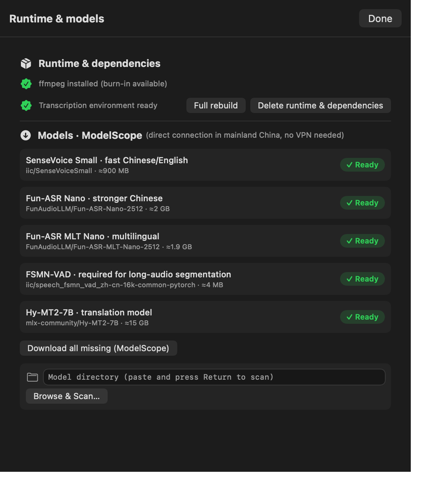
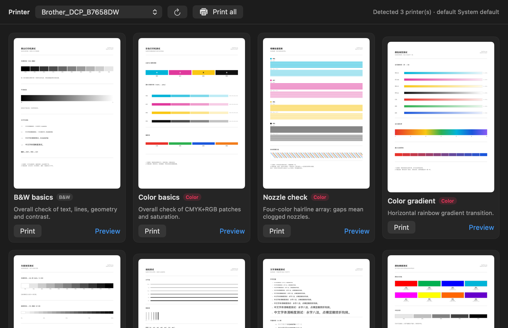

# MetriBar 🌡️🧰

**macOS 菜单栏实时监控 + 三合一工具箱**：菜单栏直接看 `↓下载 ↑上传 CPU温度 ♥心率`，点开面板看网速/CPU/GPU/风扇/内存/磁盘；内置独立工具箱——**打印机测试 · MacBook 验机 · 视频翻译**。

纯 **SwiftUI `MenuBarExtra(.window)`** 实现，不用一行 AppKit `NSStatusItem`；无网络请求、无埋点、无云同步，**完全离线只读**。

<div align="center">

**简体中文** · [English (README.en.md)](README.en.md)

`v2.0` · `com.qyx.MetriBar` · macOS 13.0+ · MIT

</div>

---

## 📑 目录

- [1. 项目概述](#1-项目概述)
  - [1.1 项目定位](#11-项目定位) · [1.2 核心能力](#12-核心能力) · [1.3 适用场景](#13-适用场景) · [1.4 技术栈](#14-技术栈) · [1.5 版本信息](#15-版本信息)
- [2. 环境与依赖](#2-环境与依赖)
  - [2.1 运行环境](#21-运行环境) · [2.2 开发环境](#22-开发环境) · [2.3 前置依赖](#23-前置依赖) · [2.4 安装步骤](#24-安装步骤) · [2.5 环境变量](#25-环境变量配置) · [2.6 数据目录](#26-路径与数据目录) · [2.7 转写环境一键构建](#27-转写环境一键构建)
- [3. 项目结构](#3-项目结构)
- [4. 核心模块详解](#4-核心模块详解)
  - [4.1 采集层与菜单栏](#41-采集层与菜单栏监控核心) · [4.2 打印机测试](#42-打印机测试模块) · [4.3 MacBook 验机](#43-macbook-验机模块) · [4.4 视频翻译](#44-视频翻译模块) · [4.5 应用内 UI 测试台](#45-应用内-ui-测试台)
- [5. 部署与运行](#5-部署与运行)
- [6. 功能使用指南](#6-功能使用指南)
- [7. 运维与扩展](#7-运维与扩展)（含 [7.8 语言支持](#78-语言支持)）
- [8. 许可证与作者信息](#8-许可证与作者信息)
- [9. 功能界面](#9-功能界面)
- [附录 A · 更新记录](#附录-a--更新记录) · [附录 B · 参考文档](#附录-b--参考文档)

---

## 1. 项目概述

### 1.1 项目定位

MetriBar 是一个**常驻 macOS 菜单栏的系统监视器**，并在 v2.0 起把三类日常刚需工具收进同一个 App：

| 维度 | 说明 |
| --- | --- |
| 形态 | `LSUIElement = true` 的 Agent 应用：**不占 Dock、无主窗口**，只活在菜单栏 |
| 核心价值 | ① 系统指标**零打扰常驻**：不打开任何窗口就能看到网速/温度/心率；② 三类工具**本地离线运行**，不上传任何数据 |
| 设计底线 | 采集在主线程之外；模型**跑完即卸载**不常驻内存；转写环境**不碰系统 Python**；所有系统信息只读 |
| 分发方式 | dmg 外部签名分发（因读取 AppleSMC 必须关闭 App Sandbox，不能上架 Mac App Store） |

### 1.2 核心能力

| 模块 | 能力要点 |
| --- | --- |
| **菜单栏监控** | 下载/上传速率、CPU 温度（含传感器 key）、CPU/GPU 占用率、手表心率 ♥；两种排版（丰富/紧凑）；等宽数字不抖动 |
| **弹出面板** | 上下行速率 + 比例条、CPU 温度与传感器、CPU/GPU 占用、风扇转速与区间、内存（App/Wired/Compressed）、磁盘可用空间、心率状态区 |
| **🖨 打印机测试** | `lpstat` 枚举 CUPS 打印机（含默认机标记）；**9 张 CoreGraphics 现场自绘 A4 测试图**：预览 / 单张打印 / 批量「常用 3 张」 |
| **🔍 MacBook 验机** | **32 条目、10 个板块、15 项必查、8 问 FAQ**，每条带分步操作；交互检测（坏点全屏/键盘全键/触控板画布/声道扫频/麦克风录放/摄像头预览）；**本机硬件快照**（序列号、电池全字段、MDM 监管、磁盘 SMART） |
| **🎬 视频翻译** | 本地 FunASR + FSMN-VAD 转写 → LLM 翻译 → 双语字幕 → 可选 ffmpeg 烧录；**一个任务一个独立 Python 子进程，结束即卸载模型**；模型目录/Python/翻译端点/并发全部可配置 |
| **模型管理** | 5 个模型从 ModelScope 国内直连下载；字节加权进度；暂停/继续（断点续传）/停止（删缓存）；`.metribar_ok.json` 完整性凭证 + 联网逐文件大小校验 |
| **环境自举** | 一键构建：独立 CPython 运行时（npmmirror）+ venv + 9 个依赖（清华镜像），全流程分步留痕 |
| **质量内建** | `Scripts/selftest.sh` 发版前全量自测（9 个分节）；应用内 **UI 测试台 `--uitest`**（23 个用例 + 15 张真实界面截图） |

### 1.3 适用场景

- **日常盯盘式监控**：下载大文件、跑编译、玩游戏时随时瞄一眼网速、温度、占用。
- **运动数据同屏**：Garmin 等手表开启「心率广播」后，心率直接进菜单栏（BLE 标准服务，无厂商 SDK）。
- **买二手 Mac / 出二手 Mac**：按验机清单逐项过关，交互检测当场做，硬件快照留证据。
- **打印机验收与巡检**：新装打印机、换墨盒/硒鼓后打一套测试图，检查堵头、套准、色彩。
- **视频字幕本地化**：访谈、课程、会议录像批量出中文字幕或双语字幕，**全程离线**，不外传素材。

### 1.4 技术栈

| 层 | 技术 | 用途 |
| --- | --- | --- |
| UI | SwiftUI（`MenuBarExtra(.window)`、`HSplitView`、`LazyVGrid`、`ImageRenderer`） | 菜单栏、面板、工具箱三 Tab |
| UI 兜底 | AppKit（`NSWindow`、`NSHostingController`、`NSOpenPanel`、`NSPanel`、`NSTextField`） | 设置窗/工具箱窗/全屏坏点窗/提示浮层/目录选择 |
| 绘制 | Core Graphics + `NSAttributedString`（Core Text） | 菜单栏非模板位图徽章、9 张打印测试页 PDF、拟真键盘画布 |
| 系统采集 | `sysctl` / `host_statistics*` / `getifaddrs` / IORegistry / AppleSMC | CPU、内存、网卡字节、GPU、温度风扇 |
| 传感器 | [SMCKit](https://github.com/srimanachanta/SMCKit) `1.1.0`（MIT） | AppleSMC 温度与风扇转速 |
| 无线 | CoreBluetooth（BLE Central，服务 `0x180D` / 特征 `0x2A37`） | 手表心率 |
| 打音视频 | AVFoundation（`AVAudioRecorder`/`AVAudioPlayer`/`AVCaptureVideoPreviewLayer`） | 麦克风录放、摄像头预览 |
| 转写侧车 | Python 3.11（独立运行时）+ FunASR + FSMN-VAD + `mlx-lm` + `openai` + `opencc` | 语音识别、翻译、双语字幕合并 |
| 烧录 | ffmpeg / ffprobe（系统或 Homebrew，可选） | 硬字幕嵌视频 |
| 构建分发 | `xcodebuild` + `hdiutil` + `codesign`（可选 `notarytool`） | 归档、签名、dmg、公证 |
| 质量 | Bash 自测脚本 + 应用内 UI 测试台（`--uitest`） | 发版门禁与界面回归 |

### 1.5 版本信息

| 项 | 值 |
| --- | --- |
| 版本 / 构建号 | `MARKETING_VERSION = 2.0`、`CURRENT_PROJECT_VERSION = 10` |
| Bundle ID | `com.qyx.MetriBar` |
| 最低系统 | `MACOSX_DEPLOYMENT_TARGET = 13.0` |
| Swift 语言模式 | `SWIFT_VERSION = 5.0`（`SWIFT_DEFAULT_ACTOR_ISOLATION = nonisolated`，UI 层显式 `@MainActor`） |
| 发布页 | <https://github.com/QinyiXiong/MetriBar/releases/tag/v2.0> |
| 发布产物 | `MetriBar-2.0.dmg`（3,566,978 B，SHA-256 `470a425c…dc4241`）、`MetriBar-2.0-Test-Report.docx`（测试报告） |
| 许可 | MIT（见 [第 8 节](#8-许可证与作者信息)） |
| 界面语言 | **仅简体中文**（详见 [7.8 语言支持](#78-语言支持)） |

---

## 2. 环境与依赖

### 2.1 运行环境

| 项 | 要求 | 说明 |
| --- | --- | --- |
| 系统 | **macOS 13.0 Ventura 及以上** | `SMAppService`（登录项）与 `MenuBarExtra` 需要 13+ |
| 芯片 | Apple Silicon 与 Intel 均支持 | 温度传感器 key 列表分别适配；**一键构建转写环境目前使用 aarch64 运行时**（见 2.7） |
| 权限 | 蓝牙（心率）、麦克风/摄像头（验机交互项，按需授权） | 不授权也能正常用其它功能 |
| 磁盘 | 监视功能 ≈ 3.4 MB | 转写链路另需 ≈ 2.2 GB（运行时 62 MB + venv 1.6 GB）+ 模型 ≈ 19 GB |

> ⚠️ **App Sandbox 必须关闭**：CPU 温度与风扇转速来自 AppleSMC 用户客户端，沙箱内打不开 io_service。
> 工程已设置 `ENABLE_APP_SANDBOX = NO`、`MetriBar.entitlements` 仅含 `com.apple.security.app-sandbox = false`。
> 代价：只能 dmg 外部签名分发，**不能上架 Mac App Store**。

### 2.2 开发环境

- **Xcode 15+**（开发验证环境为 Xcode 26/27、Swift 6 工具链，工程语言模式为 5.0）
- SwiftPM 依赖：`SMCKit`，**精确版本 `1.1.0`**，已写入 `MetriBar.xcodeproj/project.xcworkspace/xcshareddata/swiftpm/Package.resolved`

```bash
# 若包未自动解析
xcodebuild -resolvePackageDependencies -project MetriBar.xcodeproj -scheme MetriBar
```

> 为什么是 `srimanachanta/SMCKit`：原始 `beltex/SMCKit` 未提供 `Package.swift`，无法被 SwiftPM 直接解析；该 fork 补齐了清单并保持 MIT，API 完全一致（`SMCKit.shared`、`read<V: SMCCodable>(_:)`、`FourCharCode`、`allKeys()`）。
> 内网/离线环境可把仓库 clone 到 `Packages/SMCKit` 后改用 **Add Local…**，源码无需改动。

### 2.3 前置依赖

| 依赖 | 必需性 | 用途 / 说明 |
| --- | --- | --- |
| `ffmpeg` / `ffprobe` | **可选** | 只有勾选「烧录字幕进视频」才需要。App 通过**登录 shell** 探测（`/bin/bash -lc "command -v ffmpeg"`），覆盖 Homebrew 的 `ffmpeg`、`ffmpeg-full`、conda、MacPorts 等安装位置；探测结果持久缓存（`translate.ffmpegPath`），未安装时烧录会被拦截并提示 `brew install ffmpeg` |
| Python 3.11 运行时 + venv | **一键自动** | 由 App 的 `install_runtime.sh` 下载 → 建 venv → 装依赖，**不触碰系统 Python**（见 2.7） |
| ASR / 翻译模型 | 按需下载 | 5 个模型可在「环境配置」面板从 ModelScope 直连下载（见 6.5） |
| CUPS 打印机 | 打印机测试需要 | 通过 `lpstat` 枚举，`lp` 投递 |

### 2.4 安装步骤

**A. 从源码运行（开发）**

```bash
git clone https://github.com/QinyiXiong/MetriBar.git
cd MetriBar
open MetriBar.xcodeproj          # 选 MetriBar scheme → Run
```

**B. 命令行构建（无开发者账号，ad-hoc 签名）**

```bash
xcodebuild -project MetriBar.xcodeproj -scheme MetriBar -configuration Release \
  -derivedDataPath ../.DerivedData CODE_SIGN_IDENTITY="-"
open ../.DerivedData/Build/Products/Release/MetriBar.app
```

**C. 从 dmg 安装（使用者）**

```bash
hdiutil attach dist/MetriBar-2.0.dmg     # 或双击挂载
cp -R /Volumes/MetriBar/MetriBar.app /Applications/
xattr -dr com.apple.quarantine /Applications/MetriBar.app   # 未公证时的放行（见 5.4）
open /Applications/MetriBar.app
```

安装后应用**不占 Dock**，直接出现在菜单栏右上角；「登录时自动启动」在设置里一键开启（`SMAppService`，无需 plist，且会自动把登录项重指向 `/Applications`）。

### 2.5 环境变量配置

所有变量都由 App **注入子进程**，也可在终端手动导出后直接跑脚本（脚本对未设置的变量保持向后兼容）。

| 变量 | 注入方 | 用途 | 默认/取值 |
| --- | --- | --- | --- |
| `METRIBAR_MODEL_DIR` | App | 模型根目录 | 未设置时脚本用脚本同级 `models/` |
| `METRIBAR_SENSEVOICE_DIR` | App | SenseVoiceSmall 目录（支持「发布者/模型」两级嵌套） | 为空则由脚本自行解析 |
| `METRIBAR_NANO_DIR` | App | Fun-ASR-Nano-2512 目录 | 同上 |
| `METRIBAR_MLT_NANO_DIR` | App | Fun-ASR-MLT-Nano-2512 目录 | 同上 |
| `METRIBAR_VAD_DIR` | App | FSMN-VAD 目录 | 同上 |
| `METRIBAR_TRANSLATE_BASE_URL` | App | 翻译端点（OpenAI 兼容） | App 默认 `http://127.0.0.1:18888/v1` |
| `METRIBAR_TRANSLATE_API_KEY` | App | 端点 API Key | 本地服务占位值 |
| `METRIBAR_TRANSLATE_MODEL` | App | 翻译模型标识，App 注入 **Hy-MT2-7B 的绝对路径** | 端点按 model 路由，填错会 400 |
| `METRIBAR_TRANSLATE_CONCURRENCY` | App | 翻译请求并发度 | 动态分摊：`max(2, 8 / 当前并行任务数)`，避免多任务同时打爆端点 |
| `METRIBAR_JSON_PROGRESS` | App | 置 `1` 时脚本按行输出 JSON 进度 | 未设置则纯文本日志 |
| `PYTHONUNBUFFERED` | App | 置 `1`，保证进度行实时到达 | — |
| `PATH` | App | 前置追加 `/opt/homebrew/bin:/opt/homebrew/opt/ffmpeg-full/bin:/usr/local/bin` | 让脚本能直接调到 ffmpeg |

### 2.6 路径与数据目录

| 路径 | 内容 |
| --- | --- |
| `~/Library/Application Support/MetriBar/` | 应用数据根（`ToolPaths.supportDir`） |
| ├─ `runtime/` | 独立 CPython 运行时（`runtime/python/bin/python3`，约 62 MB） |
| ├─ `env/` | 转写虚拟环境（`env/bin/python3`，约 1.6 GB） |
| ├─ `models/` | 默认模型目录（可改） |
| ├─ `install_runtime.sh` | 构建脚本副本（随包携带，供排查与手动重跑） |
| └─ `logs/MetriBar.log` | App 内「日志」浮窗读取的文件（**阅完即删**，见 7.1） |
| App 包内 `Contents/Resources/pipeline/` | `transcribe.py`、`embed_subtitle.py`（可作为流水线目录默认值） |
| App 包内 `Contents/Resources/TestPages/` | 9 张原版打印测试页 PDF（与 `Vendor/TestPages` 逐字节一致，自测会校验） |
| `~/Library/Logs/DiagnosticReports/` | 系统崩溃报告（自测会检查近 1 小时是否有崩溃） |
| `dist/MetriBar-<版本>.dmg` | 打包产物 |

### 2.7 转写环境一键构建

「环境配置」面板点 **一键构建环境**（或手动执行随包脚本）会走这套固定流程，每步都写进日志并带时间戳：

| 步骤 | 动作 | 失败行为 |
| --- | --- | --- |
| STEP1 | `curl -fL --retry 3` 下载独立 CPython：`https://registry.npmmirror.com/-/binary/python-build-standalone/20250918/cpython-3.11.13%2B20250918-aarch64-apple-darwin-install_only.tar.gz` | `FAIL STEP1 下载失败` → 退出 1 |
| STEP2 | 解压到数据目录，把 tar 内的 `python/` 改名为 `runtime/` 并校验 `runtime/bin/python3` 存在 | `FAIL STEP2 …` → 退出 1 |
| STEP3 | `runtime/bin/python3 -m venv env` | `FAIL STEP3 venv失败` → 退出 1 |
| STEP4 | 清 macOS 真实 pip 缓存（`~/Library/Caches/pip`）后逐包安装（`--no-cache-dir`，清华镜像 `https://pypi.tuna.tsinghua.edu.cn/simple`） | 任一包失败 `FAIL <包名>` → 退出 1 |
| STEP5 | `import funasr, torch, mlx_lm, openai, soundfile, opencc` 验证 | `FAIL import验证` → 退出 1 |

STEP4 的 9 个包（顺序即安装顺序）：`funasr==1.4.1`、`torch`、`torchaudio`、`mlx-lm`、`openai`、`opencc-python-reimplemented`、`soundfile`、`python-multipart`、`librosa`。
仅 `funasr` 有版本锁定，其余跟随最新；**`mlx-lm` 与 `mlx` 主版本需一致**（不一致会导致并发解码卡死，自测会实机比对主版本）。

> 进度显示：App 解析脚本输出（`STEP*` 与 `依赖 N/9`）换算成 0–100%：运行时 10%、venv 28%、依赖 35→95%、验证 96%、完成 100%，且**只前进不回退**。

---

## 3. 项目结构

```
MetriBar/
├── MetriBar.xcodeproj/                 # Xcode 工程（含 SMCKit 1.1.0 的 Package.resolved）
├── MetriBar.entitlements               # 仅 app-sandbox=false
├── MetriBar/                           # 应用源码（Swift，27 个文件 ≈ 7,939 行）
│   ├── MetriBarApp.swift               # @main：MenuBarExtra(.window) + 启动自检/测试台入口
│   ├── UITestHarness.swift             # 应用内 UI 测试台（--uitest：驱动视图 + 截图 + 断言）
│   ├── Info.plist                      # 手写 Info.plist（LSUIElement/用途说明/版本占位）
│   ├── Model/                          # ① 采集层（与 UI 完全解耦，均不在主线程）
│   │   ├── MetricsSnapshot.swift       # 不可变数据快照（值类型）
│   │   ├── MetricsEngine.swift         # DispatchSourceTimer 调度 + @MainActor MetricsStore
│   │   ├── NetworkCollector.swift      # getifaddrs + if_data，网卡白名单，Δ→bytes/s
│   │   ├── CPULoadCollector.swift      # host_statistics(HOST_CPU_LOAD_INFO) ticks 差值
│   │   ├── MemoryCollector.swift       # host_statistics64(HOST_VM_INFO64)
│   │   ├── DiskCollector.swift         # mountedVolumeURLs + URLResourceValues
│   │   ├── GPUCollector.swift          # IORegistry PerformanceStatistics（EMA 平滑）
│   │   ├── SMCSensorReader.swift       # actor：SMCKit 封装，温度 key 解析 + 风扇枚举
│   │   └── HeartRateCollector.swift    # CoreBluetooth BLE 心率（0x180D/0x2A37），有限扫描
│   ├── Views/                          # ② 界面层
│   │   ├── MenuBarLabelView.swift      # 菜单栏文本（丰富→位图 / 紧凑→Text）
│   │   ├── PopoverView.swift           # 弹出面板（网速/温度/占用/风扇/内存/磁盘/心率）
│   │   ├── SettingsView.swift          # 设置：刷新频率 / 自启 / 显示项 / 单位 / 排版 / 心率
│   │   ├── ToolboxView.swift           # 工具箱容器：三 Tab（访问过即常驻，切回零重建）
│   │   ├── PrinterTab.swift            # 打印机测试：CUPS 枚举 + 9 张自绘 A4 测试页
│   │   ├── VerifyTab.swift             # MacBook 验机：清单模型 + 板块化 UI + 硬件快照
│   │   ├── VerifyTests.swift           # 验机交互检测：坏点/声道/麦克风/摄像头/键盘/触控板 + HUD
│   │   └── TranslateTab.swift          # 视频翻译：队列、模型下载、环境构建、翻译服务
│   ├── Support/                        # ③ 基础设施
│   │   ├── AppSettings.swift           # 设置项 + SMAppService 登录项（含自愈）
│   │   ├── MenuBarBadge.swift          # Core Text 徽章：固定槽位、@2x、胶囊底、非模板
│   │   ├── UIComponents.swift          # PanelSection/MetricRow/SlimGauge/SettingsWindow/离屏快照
│   │   ├── ToolboxWindow.swift         # 工具箱独立窗口（持 regular 直到关闭再还原 accessory）
│   │   ├── Shell.swift                 # 子进程执行封装（同步返回 rc + 输出）
│   │   ├── Formatters.swift            # 速率/容量/温度/百分比格式化
│   │   └── Diagnostics.swift           # os_log 入口（subsystem com.qyx.MetriBar）
│   ├── Resources/
│   │   └── install_runtime.sh          # 转写环境一键构建脚本（随包，自动同步进 Resources）
│   ├── Assets.xcassets/                # AppIcon（自绘小机器人）+ AccentColor
│   └── zh-Hans.lproj/                  # 中文本地化（InfoPlist.strings）
├── Vendor/                             # ④ 侧车与素材（作为 folder reference 整体进包）
│   ├── pipeline/transcribe.py          # 视频→SRT（FunASR+VAD）+ 翻译 + 双语合并（750 行）
│   ├── pipeline/embed_subtitle.py      # 硬字幕烧录（205 行，ffmpeg 封装）
│   └── TestPages/*.pdf                 # 9 张原版打印测试页（自测逐字节校验）
├── Scripts/
│   ├── selftest.sh                     # 发版前全量自测（9 分节，455 行）
│   ├── build_dmg.sh                    # 归档 → staging → 签名 → dmg（可选公证，97 行）
│   └── make_icon.swift                 # App 图标自绘脚本（209 行）
├── docs/
│   ├── Xcode配置清单.md                 # 工程配置逐条核对表
│   ├── 验机参考站点_spec.md                 # 验机清单的规格来源（30 页抓取整理）
│   ├── MetriBar-测试报告.docx           # 全量测试报告（含 15 张界面截图）
│   ├── make_report.py                  # 测试报告生成脚本
│   └── 预览/*.png                       # README 引用的界面图
└── README.md / README.en.md
```

---

## 4. 核心模块详解

### 4.1 采集层与菜单栏（监控核心）

**设计思路**：UI 与系统调用彻底解耦——采集器在**自有串行队列**上跑，主线程只接收一个不可变快照。

```
DispatchSourceTimer (串行队列, qos .utility, leeway 120ms)
   ├─ NetworkCollector.sample()      同步、微秒级：getifaddrs
   ├─ MemoryCollector.sample()       同步：host_statistics64
   ├─ CPULoadCollector.sample()      同步：host_statistics
   ├─ DiskCollector.sample()         同步：URLResourceValues
   └─ Task { await SMCSensorReader } 异步：SMC IOKit 往返
          ↓  MetricsSnapshot（一次性整体投递）
   @MainActor MetricsStore.publish()  主线程只做一次赋值 → 触发 SwiftUI 刷新
```

**三道防线**（`MetricsEngine.swift`）：

1. 所有系统调用都在自有队列，主线程零系统调用；
2. `isSampling` 闸门：SMC 偶发阻塞时**丢弃本次 tick**，任务绝不堆积；
3. `leeway: .milliseconds(120)` + 串行队列，兼顾功耗与稳定。

**入出参**：`MetricsStore(interval:)` 输入刷新间隔（默认 2 秒，设置项 1–10 秒可调）；`store.snapshot` 输出 `MetricsSnapshot` 值类型，菜单栏与面板都读它。

**边界处理**：字节计数器为 `UInt32`，采集时做**回绕补偿**；重启/异常间隔（≤50 ms 或 ≥30 s）自动重建基线；睡眠唤醒后同样重置。读不到温度显示 `--`，不崩、不造数据。

**菜单栏为什么是自绘位图**：`MenuBarExtra` 的 label 会被状态栏按 template 重绘——`Text` 的颜色被抹平、`Text("\(Image(...))")` 里的 SF Symbol 直接不显示。因此「丰富」排版用 Core Text 在 `NSBitmapImageRep` 上绘制，按主屏 `backingScaleFactor` 生成、标记 `isTemplate = false`；**固定图标/数值/单位槽位**让徽章宽度恒定（实测 177×18 pt @2x），数字变化不抖动，内容签名缓存避免重画。「紧凑」排版走纯 `Text`。

**网卡白名单**：只统计 `en*`、`pdp_ip*`；排除 `lo0`、`utun*`/`ipsec*`、`awdl0`/`llw0`/`nan0`/`ap1`、`bridge0`、`gif0`/`stf0`、`anpi*`、`vmnet*`。

> ⚠️ 踩坑记录（源码注释保留）：字节计数器**必须**从 `ifaddrs.ifa_data` 读，不能从 `ifa_addr` 读。AF_LINK 的 `ifa_addr` 是 `sockaddr_dl`，按 `if_data` 偏移去读会撞到 `ifi_baudrate`（实测恒定 `748800000`），现象是「下载速率永远 0」而上传恰好正常。

**SMC 传感器**：先在候选 key 中挑**可读且合理（5–125 ℃）**的传感器取最大值，找不到时扫描 `Tp*`/`TC*`/`Tc*` 兜底，并枚举 `FNum` → `F{i}Ac/F{i}Mn/F{i}Mx` 取风扇。Apple Silicon 常见 `Tp0C`/`Tp0R`/`Tp04`…，Intel 常见 `TC0P`/`TC0D`…；解码类型支持 `flt `/`sp78`/`fpe6`/`ui8 `/`ui16 `。面板会显示当前采用的具体 key，便于核对读数来源。

**心率（BLE）**：作为 Central 扫描 → 连接 → 订阅 `0x2A37`，解析 flags 兼容 8/16-bit 与接触位，并用 20…260 过滤噪声。**每轮只扫 30 秒**，超时自动停止省电；**再次点开面板会自动重起一轮**，连上后保持；不连接时不偷偷重扫。未连接时菜单栏隐藏 ♥ 段（面板保留状态区）。

### 4.2 打印机测试模块

**设计思路**：复刻经典「打印机测试页」工作流，但**不引入 HTTP 服务器**——测试页由 Core Graphics 现场绘制成 A4 PDF，直接交给 CUPS。

- **枚举**：`lpstat -v` / `lpstat -d` 解析出打印机列表与默认机（自测内置中英文两种 `lpstat` 输出的解析回归）。
- **投递**：`/usr/bin/lp -d <打印机> -t <标题> <pdf>`；批量「常用 3 张」串行投递并统计失败项。
- **9 张测试页**（`TestPattern`，id → 标题 / 用途）：

| id | 标题 | 用途 | 色彩 |
| --- | --- | --- | --- |
| `basic-bw` | 黑白基础页 | 文字、线条、几何与对比度总检 | 黑白 |
| `basic-color` | 彩色基础页 | CMYK+RGB 色块与饱和总检 | 彩色 |
| `nozzle-check` | 喷头堵塞检测 | 四色细线阵：断线=堵头 | 彩色 |
| `color-gradient` | 彩色渐变 | 彩虹横向渐变过渡测试 | 彩色 |
| `grayscale-gradient` | 灰度渐变 | 白→黑多级灰阶过渡 | 黑白 |
| `fine-lines` | 精细线条 | 递减线宽分辨率测试 | 黑白 |
| `text-clarity` | 文字清晰度 | 多字号中英混排阶梯 | 黑白 |
| `color-accuracy` | 色彩还原 | 肤色/天空/植被参照色卡 | 彩色 |
| `alignment-grid` | 对齐与套准 | 角标/十字/斜线检查进纸歪斜 | 黑白 |

**入出参**：`PrinterModel.refresh()` 输入无参，输出 `printers`（含默认标记）与 `toast` 状态文案；`print(_:)` 输入单个或多个 `TestPattern`，输出成功/失败 toast（失败项会打印包名与 `lp` 返回）。

**边界处理**：无打印机时列表区显示空态引导；`lp` 非 0 时提示原文错误而不是假装成功；测试页 PDF 与 `Vendor/TestPages` 的**逐字节一致性**由自测保障。

### 4.3 MacBook 验机模块

**规格来源**：清单结构对照 验机参考站点（已抓取 30 页整理为 [`docs/验机参考站点_spec.md`](docs/验机参考站点_spec.md)），文案与实现为本项目原创。当前规模：**10 个板块 / 32 条目 / 15 项必查 / 8 问 FAQ，每条都带分步操作**，保真度由自测与 UI 测试台双重断言。

| 板块 | 关键条目（★=必查） |
| --- | --- |
| 拍摄开箱视频 | ★拍摄开箱视频（六个面/纸质拉条/序列号同框/一镜到底） |
| 安全检查 | ★激活锁、★MDM 企业锁、★序列号核对、★维修历史与配件核验、★诊断模式（ADP000，含 ⌥D 备选）、★序列号查询 |
| 屏幕检测 | ★坏点检测（全屏交互）、★原装屏幕核验、屏幕压力测试、屏幕漏光、镀膜检查、亮度检测 |
| 输入设备 | 触控板检测（画布）、键盘全键测试（拟真键盘）、Touch ID |
| 音频检测 | ★声音检测（声道扫频）、★麦克风检测（录放）、★摄像头检测（预览） |
| 端口与连接 | USB-C/雷电、WiFi 与蓝牙、MagSafe |
| 机身与外观 | 铰链/转轴、★进水指示器（LCI 判读 + P5 拆机步骤）、外壳检查 |
| 硬件状态 | SSD 健康、风扇/散热 |
| 外部工具 | ★电池检测、性能测试、音画质量、刷新率检测（UFO Test 含 Safari 60fps 解除方法） |
| 最后一步 | ★抹掉数据重装系统（含两条路径、APFS/抹掉卷组、停在设置助理复验企业监管） |

**状态模型**：`VerifyModel` 用 `[String: Int]` 保存每项状态（`0 todo / 1 pass / 2 fail`），`UserDefaults` 键 `verify.checklist.v1` 持久化；`requiredDone/requiredTotal/failCount` 驱动顶部进度条与「不通过 N」提示。

**交互检测实现**（`VerifyTests.swift`）：

| 检测 | 实现要点 | 边界处理 |
| --- | --- | --- |
| 坏点检测 | 无边框全屏 `NSWindow`（`.screenSaver` 层级），5 张纯色；**提示内嵌在窗口内容视图**里逐张显示「第 N/5 张：颜色名」；空格/→/↓/**单击**=下一张，←/↑=上一张，Esc 退出 | 提示不依赖独立浮层窗口，切换颜色不会丢提示 |
| 键盘全键 | 自绘 `NSView` 拟真键帽（竖向渐变+描边+投影+shift 副标）；`keyCode` 全部取自 Apple 官方 `kVK_*` 表，`keyDown`/`flagsChanged`/`insertText` 三路兜底（修饰键、Globe 键、中文输入法合成） | F 键被系统占用时提示按 `fn+F`；「重置」清空已测记录 |
| 触控板 | SwiftUI `Canvas` + `DragGesture` 采集轨迹，四角与边缘可覆盖 | 「清屏」重来 |
| 声道扫频 | `AVAudioPlayer` 顺序播放 左(-1)/中(0)/右(1) pan 定位 | 无声卡也仅静默失败 |
| 麦克风 | `AVAudioRecorder` 录 5 秒 → 自动回放；**不设录制时长**，由定时器统一停止（避免到点自停后 `isRecording=false` 导致跳过回放），并带 15 秒兜底回收提示浮层 | 权限未授权/无输入设备 → 明确中文指引；权限被拒不再弹系统框 |
| 摄像头 | `AVCaptureVideoPreviewLayer` 作为 **backing layer** 随窗口 `layout()` 自适应；`startRunning` 放后台避免开窗卡顿；标题显示设备名 | 无设备/占用/未授权 → 提示而非空白窗 |
| 提示浮层 | 单例 `TestHUD`（非激活 `NSPanel`、`ignoresMouseEvents`、底部居中），用于麦克风/摄像头等状态提示；`Guide.hud` 提供 4 秒自动消失的一次性提示 | 面板可复用、可强制回收 |

**硬件快照**（`collectHardware()`，全部本机只读、不联网）：

- 机型/处理器（含性能+能效核数解析 `proc 18:6:12:0` → 「18 核 CPU（6 性能 + 12 能效）」）/内存/序列号/系统版本；
- **激活锁**（`activation_lock_status`，措辞区分「本机自用正常」与「收购机须卖家关闭」）；
- **电池全字段**：`system_profiler SPPowerDataType` + `ioreg -rn AppleSmartBattery` → 健康度、循环次数、满充/设计容量与健康度百分比、剩余容量、电压/电流/温度、序列号与型号、充电状态、电源模式；
- 显示器（内建/外接 + 分辨率）、磁盘空间、内置硬盘名、磁盘 SMART；
- **MDM 监管**：`profiles status -type enrollment`，逐行只看冒号后的值判定 `yes/是`，避免把 `No` 误判为已注册。

> ⚠️ ioreg 解析坑（源码注释保留）：顶层是 `"Key" = 123`，而嵌套字典（`BatteryData`）里是 `"Key"=123`（**等号无空格**）。只匹配 `" = "` 会漏掉容量字段，必须两者都容忍。

### 4.4 视频翻译模块

#### 4.4.1 任务执行与子进程协议

**设计思路**：**一个任务一个独立 Python 子进程**，进程结束即由系统回收全部内存/显存——「模型绝不常驻」是进程生命周期的硬保证，不是定时器。

- 启动：`executableURL = <supportDir>/env/bin/python3`，`arguments = [pipelineDir/transcribe.py, 视频文件名, 视频绝对路径, <视频去扩展>.srt, 模型key]`，`currentDirectoryURL = 视频所在目录`。
- 输出采集：stdout 与 stderr 合并为一个 Pipe，按 `\n` 逐行消费。
- **进度协议**（脚本唯一结构化输出，逐字格式）：

```python
print(json.dumps({"metriBarProgress": 1, "stage": stage, "percent": percent,
                  "message": message}, ensure_ascii=False), flush=True)
```

Swift 侧判定 `line.hasPrefix("{") && line.contains("\"metriBarProgress\"")`，取 `stage`/`percent`/`message`；**percent 只增不减并上限 99**，`message` 为空时不覆盖已有细节（防止文案闪烁）。非 JSON 行只写日志、不刷卡片（杜绝 HTTP 访问日志造成的闪烁）。

- **退出码语义**：Swift 只看 `terminationStatus`——`0` 视为成功并继续烧录；非 0 → 任务「失败」+ `退出码 N`；用户点停止 → 「已停止」。脚本异常直接冒泡为非 0。
- **停止**：`Process.terminate()`（SIGTERM）→ 脚本侧靠 SIGTERM 中断；App 退出时通过信号处理链清理子进程（见 7.2）。

**并发**：顶部 Stepper 设「同时处理 N」（1–8，`UserDefaults.translate.concurrency`）。排队/运行状态由 `autoRunning` 闸门与 `runNext()` 调度，队列跑空自动关闸并停止翻译服务。

**产物**（与视频同目录）：

| 文件 | 说明 |
| --- | --- |
| `<视频>.srt` | 原始字幕（识别结果） |
| `<视频>.(中文).srt` | 简体中文（OpenCC 转换 + 翻译） |
| `<视频>.(双语).srt` | 双语（原文 + 中文） |
| `<视频>.meta.json` | 元数据 |
| `<视频>.字幕版.mp4` | 烧录后的成片（仅在勾选烧录且 ffmpeg 可用时） |
| `pipeline/logs/<名称>.log` | 脚本侧日志（含识别/翻译/合并全过程） |
| `pipeline/音频/<名称>.wav` | 抽取的音频（中间产物） |

**边界处理**：视频文件不存在/无权限 → 任务失败并给出原因；ffmpeg 缺失时**在派发前**拦截并提示安装（不会跑到一半才失败）；已存在同名字幕时脚本会跳过重复合并；失败现场（自测的 e2e）会保留临时目录便于取证。

#### 4.4.2 模型下载引擎

5 个模型全部从 **ModelScope 国内直连**（`msRepo` 逐字取自源码）：

| key | 仓库 | 本地目录名 | 体积 |
| --- | --- | --- | --- |
| `sensevoice` | `iic/SenseVoiceSmall` | `SenseVoiceSmall` | ≈900 MB |
| `nano` | `FunAudioLLM/Fun-ASR-Nano-2512` | `Fun-ASR-Nano-2512` | ≈2 GB |
| `mlt-nano` | `FunAudioLLM/Fun-ASR-MLT-Nano-2512` | `Fun-ASR-MLT-Nano-2512` | ≈1.9 GB |
| `vad` | `iic/speech_fsmn_vad_zh-cn-16k-common-pytorch` | `fsmn-vad` | ≈4 MB |
| `mt` | `mlx-community/Hy-MT2-7B` | `Hy-MT2-7B` | ≈15 GB |

**实现细则**：

- 先拉官方清单（`/api/v1/models/<repo>/repo/files?Revision=master&Recursive=true`）拿到全部文件与字节数，**总字节数作为进度分母**（字节加权，而不是"第几个文件"）。
- `curl -fSL -o <目标>`；已存在且大小一致的文件跳过；有 `.part` 残留时用 `-C -` 断点续传。
- 轮询目标文件大小（0.6 s）实时更新 `bytesDone`，**单调不回退**（`if snap >= st.bytesDone`），进度不会来回滑动。
- **暂停**：`dlPaused` 哨兵 + 终止当前 curl → 循环立即停下不再开下一个文件，状态「已暂停」，断点保留。
- **继续**：清哨兵后重新调用下载，按已完成字节跳过后继续。
- **停止**：`dlCancel` + 终止 + 删除该模型目录，回到未下载。
- **完成凭证**：`.metribar_ok.json`（含 files/bytes/at）。启动扫描时：有凭证 → 「✓ 已就绪」；**无凭证 → 联网对官方清单逐文件比对大小，全部一致才补写凭证**，否则显示「⚠ 不完整（曾被中断）」——绝不允许半成品被当成就绪。

**边界处理**：仓库 404/不可达由自测的「仓库在线」检查在发版前拦下；同名文件大小不符会重新下载；单模型校验只跑一次（`verifying` 去重），避免切 Tab 重复请求。

#### 4.4.3 环境构建

见 [2.7](#27-转写环境一键构建)。实现上 App 只做三件事：定位脚本（`Bundle.main` → 失败回退到 `supportDir` 的缓存副本）、用 `/bin/bash` 拉起、**逐行转发输出**到日志并解析进度。构建状态文字实时跟随脚本步骤（`依赖 5/9 openai` 等），失败时日志里必有 `FAIL <步骤>`。

#### 4.4.4 翻译服务生命周期与并发

- **按需拉起**：队列开始运行时启动 `mlx_lm.server --model <Hy-MT2-7B 绝对路径> --port <随机空闲端口> --decode-concurrency 8`；`findFreePort()` 用 `bind` 探测可用端口，端口不固定、不在界面展示。
- **跑完即卸**：队列排空 → 停止服务 → 模型内存全部释放（`stopServer()`）。
- **并发防雪崩**：App 把 `METRIBAR_TRANSLATE_CONCURRENCY` 设为 `max(2, 8 / 当前并行任务数)` 注入子进程——多任务同时跑时自动分摊额度，避免 3 个任务 × 8 连接把端点打爆（历史上表现为满屏 `Retrying request…`）。
- **脚本侧默认值**：未注入时 `base_url = http://127.0.0.1:18888/v1`、并发 4、模型标识 `hy-mt2-7b`，与环境变量注入完全向后兼容。
- **版本约束**：`mlx-lm` 与 `mlx` 主版本必须一致；错配会让单请求也挂起（自测会实机比对主版本号）。

### 4.5 应用内 UI 测试台

**为什么存在**：Agent/终端进程没有 macOS 的「屏幕录制」与「辅助功能」权限——`screencapture` 报 `could not create image from display`，UI 脚本点击被拒。于是把测试能力做进 App：**由 App 自己构建真实视图树、驱动真实 ViewModel、渲染真实界面并截图断言**。

```bash
MetriBar.app/Contents/MacOS/MetriBar --uitest <输出目录>
# 产物：<输出目录>/uitest-result.json + 15 张 PNG + trace.log
```

**实现要点**：

- 入口必须是 **RunLoop 定时器**而非 `DispatchQueue.main.async`：测试台内部要嵌套 RunLoop 等待异步结果，而 libdispatch 主队列**不可重入**——入口若是主队列 block，嵌套期间主队列回调永不执行，所有异步断言都会失真。该约束由用例 `harness.main-queue-probe` 常驻自检。
- 渲染用**真实窗口 + `CALayer.render`**（含竖直翻转校正）；`cacheDisplay` 会丢 SwiftUI 图层文字、`ImageRenderer` 不支持 `HSplitView`（会渲染成黄色禁用图），二者均已排除。
- 统一**深色 appearance + 字面量底色**，避免「深色解析出白字落在白底上隐形」的假截图。
- **状态隔离**：用例开始前备份用户验机清单，结束原样还原/删除键，绝不污染真实数据。

**23 个用例覆盖**：三个 Tab 渲染、验机清单状态机与持久化往返、键盘/触控板画布、坏点全屏窗（开关+逐张提示计数）、队列 5 种任务状态、环境构建中/就绪两态、下载区 5 种状态、环境面板、步骤弹窗、提示浮层、TCC 权限状态（只读不弹窗）、**清单保真度**（板块/必查/FAQ/步骤完整性逐项断言）、**硬件快照真机断言**（电池字段齐全）、**构建进度解析**（喂入脚本真实输出 15 行，断言 9/9 解析成功、单调、末值 1.00）、**目录选定即扫描**（临时目录注入模型验证命中计数）、麦克风真录真放（未授权时如实跳过）、性能实测。

---

## 5. 部署与运行

### 5.1 本地开发启动

```bash
open MetriBar.xcodeproj        # 选 MetriBar scheme → ⌘R
```

启动后无 Dock 图标，直接在菜单栏；停止运行即退出。开发期常用开关：

```bash
# 逐 tick 明细日志
defaults write com.qyx.MetriBar MetriBarVerboseLogging -bool YES
log stream --predicate 'subsystem == "com.qyx.MetriBar"' --level info
defaults delete com.qyx.MetriBar MetriBarVerboseLogging

# 排版自检：把菜单栏徽章（深/浅）与面板离屏渲染成 PNG 到临时目录
defaults write com.qyx.MetriBar MetriBarDebugSnap -bool YES
open MetriBar.app
defaults delete com.qyx.MetriBar MetriBarDebugSnap

# 自动打开设置窗（验证开窗链路）
defaults write com.qyx.MetriBar MetriBarDebugOpenSettings -bool YES

# UI 测试台
/Applications/MetriBar.app/Contents/MacOS/MetriBar --uitest /tmp/uitest
```

### 5.2 生产构建

```bash
xcodebuild -project MetriBar.xcodeproj -scheme MetriBar -configuration Release \
  -derivedDataPath ../.DerivedData CODE_SIGN_IDENTITY="-"
codesign --force --deep --sign - --entitlements MetriBar.entitlements \
  ../.DerivedData/Build/Products/Release/MetriBar.app
```

### 5.3 打包 dmg（`Scripts/build_dmg.sh`）

脚本实际执行的流程（`set -euo pipefail`）：

1. 参数解析：`--identity <ID>`、`--notarize <apple-id> <team-id>`、`-h`（未知参数 `exit 64`）；凭据 profile 名固定 `MetriBar-Notary`。
2. `rm -rf build` → `xcodebuild … -archivePath build/MetriBar.xcarchive archive`（校验 archive 内 App 存在）。
3. 用 `PlistBuddy` 读 `CFBundleShortVersionString` 得到版本号 → 决定 dmg 文件名。
4. staging：拷贝 App + `Applications` 软链 + `README.md` 到 `build/staging/`。
5. 签名：有 `--identity` → `codesign --force --deep --options runtime --timestamp`；否则 ad-hoc（`--sign -`）；随后 `codesign --verify --deep --strict`。
6. `hdiutil create -volname "MetriBar" -srcfolder build/staging -ov -format UDZO dist/MetriBar-<版本>.dmg`。
7. 若带 `--notarize`：`notarytool submit … --wait` + `stapler staple`。
8. 收尾 `spctl -a -vv -t open` 校验（ad-hoc 下提示属正常）并打印产物路径与体积。

```bash
./Scripts/build_dmg.sh                       # ad-hoc → dist/MetriBar-2.0.dmg
./Scripts/build_dmg.sh --identity "Developer ID Application: 你的名字 (TEAMID)" \
                       --notarize you@example.com TEAMID
```

### 5.4 本地试用（Gatekeeper 放行）

ad-hoc/未公证的 App 被下载后会被拦（提示「已损坏」或「来自身份不明的开发者」）——**不是 App 坏了**。执行一次即可永久放行：

```bash
xattr -dr com.apple.quarantine /Applications/MetriBar.app
open /Applications/MetriBar.app
```

有开发者账号（$99/年）则走 `--identity` + `--notarize` 正式分发，对方双击即开、无需终端。

### 5.5 发版流程（本仓库实际使用）

```bash
# ① 自测门禁（失败即阻断发版）
./Scripts/selftest.sh              # 20 项
./Scripts/selftest.sh --full-e2e   # 24 项（含合成语音端到端）
# ② 打包
./Scripts/build_dmg.sh
# ③ 提交与发布
git add -A && git commit -m "…" && git push origin main
gh release upload v2.0 dist/MetriBar-2.0.dmg --clobber
```

> 本仓库 v2.0 的发布资产已做过**字节级回验**：从 Release 下载回来算 SHA-256 与本地一致，并挂载 dmg 直接运行其中的 App 跑完 23 项 UI 测试。

---

## 6. 功能使用指南

### 6.1 菜单栏与面板

1. 启动后菜单栏出现 `↓12.4M ↑980K 66° ♥72`（字段可在设置里增删：上传速率、温度、CPU、GPU、心率）。
2. **点状态栏**打开面板：上/下行速率与比例条、CPU 温度（含传感器 key）、CPU/GPU 占用、风扇转速、内存分布、磁盘余量、心率状态；同时会**自动重起一轮心率搜索**。
3. 设置（面板齿轮或 `⌘,`）：刷新频率、开机自启、显示项、单位（速率/温度）、**排版样式**（丰富/紧凑，带实时预览）、心率设备名过滤。
4. 退出：面板右下角 ⏻。

### 6.2 打印机测试

1. 工具箱 → **打印机测试** → 自动 `lpstat` 枚举（默认机有标记）。
2. 选打印机 → 卡片网格点开任意测试页**预览大图**。
3. 确认无误 → 单张「打印」；日常验收用「**打印常用 3 张**」（黑白基础 / 喷头堵塞 / 对齐套准）。
4. 失败会在顶部 toast 里给出 `lp` 的原始错误。

### 6.3 MacBook 验机

1. 工具箱 → **MacBook 验机**：左侧板块化清单，右侧本机硬件快照（自动采集，可点右上角刷新）。
2. 每条卡片：**步骤**（分步操作说明，大字版）/ **打开**（官方或工具链接）/ **通过 / 不通过**；带「交互」标记的点 **开始** 直接做检测。
3. 顶部进度条显示 `必查 N/15`，有「不通过」会单独标红；状态**持久保存**，可「重置」。
4. 交互检测操作速查：

| 检测 | 操作 | 判定 |
| --- | --- | --- |
| 坏点检测 | 点开始进全屏，**空格/→/单击**下一张（共 5 张纯色），**←/↑**上一张，Esc 退出 | 固定亮点/黑点即异常 |
| 键盘全键 | 点开始后在画布上逐键敲击 | 未点亮的键即不触发；F 键请按 `fn+F` |
| 触控板 | 点开始在画布上画圈、对角线、四角 | 断线/不跟手即异常 |
| 声音检测 | 点开始依次听 左→中→右 | 定位不清/破音即异常 |
| 麦克风 | 点开始录 5 秒 → 自动回放；录音中提示剩余秒数 | 无声/断续即异常（首次需授权） |
| 摄像头 | 点开始开预览窗（显示设备名） | 画面黑/有横纹即异常（首次需授权） |

5. 硬件快照里的**电池全字段**可直接替代第三方电池工具（健康度、循环、满充/设计容量、电压电流温度、序列号、充电状态）。

### 6.4 视频翻译

1. 顶部「**添加视频**」或直接把文件拖进窗口（可多选）。
2. 选 ASR 模型（`SenseVoiceSmall` 快速 / `Fun-ASR-Nano` 中文更强 / `Fun-ASR-MLT-Nano` 多语种）、设置「同时处理 N」。
3. 需要成片就勾选「**烧录字幕进视频**」（未装 ffmpeg 会被拦下并给出安装提示）。
4. 点「**开始处理**」→ 卡片显示阶段与彩色进度条（识别=蓝 / 翻译=橙 / 烧录=紫 / 完成=绿 / 失败=红），条下常驻细节文字（如「正在翻译第 12/40 句」）。
5. 卡片操作：打开输出（成片或字幕）、重试、移除；「全部停止」终止所有任务。翻译服务灯变绿表示 `mlx_lm.server` 已就绪。
6. 产物命名见 [4.4.1](#441-任务执行与子进程协议)。

### 6.5 模型管理（环境配置面板）

| 状态 | 可做的操作 |
| --- | --- |
| 未下载 / 不完整（曾被中断） | 「ModelScope 下载」/「重新下载」 |
| 下载中 | 「暂停」（断点保留）/「停止」（删缓存回到未下载） |
| 已暂停 | 「继续」（从断点续传） |
| ✓ 已就绪 | 「重新下载」 |

- 「**全部下载缺失**」一键补齐 5 个模型。
- 「**模型目录**」输入框：粘贴路径后**回车即扫描**；「**浏览并扫描…**」选目录后立即**只扫描该目录**并回报「命中 N/5 个模型（模型名）」或「该目录下未发现任何模型」。
- 就绪判定不是「有文件就算」：无凭证的目录会**联网逐文件比对大小**，全对才置就绪。

### 6.6 环境配置面板

- 「**运行时与依赖**」区块：ffmpeg 状态行（未装时给出 `brew install ffmpeg` 与复制按钮）、转写环境状态与**构建进度条**（分阶段换算，只前进不回退）。
- 「**一键构建环境**」：走 [2.7](#27-转写环境一键构建) 全流程（首次约 1–2 分钟，取决于网络）。
- 「**全量重建**」：先清空 venv 与 pip 缓存再装。
- 「**删除运行时与依赖**」：两步内联确认，删除 `runtime/` + `env/` + pip 缓存。

### 6.7 高级用法

| 场景 | 做法 |
| --- | --- |
| 用自己的 Python 跑流水线 | 设置里改 Python 路径/流水线目录，或用 `METRIBAR_*` 变量直接命令行跑 `transcribe.py` |
| 接自建翻译服务 | 当前 App 内**没有**端点输入界面：默认由 App 自己拉起本地 `mlx_lm.server`。要走自建端点，请直接在终端跑脚本并设置 `METRIBAR_TRANSLATE_BASE_URL` / `METRIBAR_TRANSLATE_MODEL` / `METRIBAR_TRANSLATE_API_KEY`（脚本原生支持，端点需 OpenAI 兼容且按 `model` 路由）。`TranslateSettings` 中已存在 `translateBaseURL` / `translateModel` / `serverPort` 三个属性，但**当前无界面入口、运行期也未使用**，属预留字段 |
| 降低/提高翻译并发 | 设「同时处理 N」；App 会按 `max(2, 8/N)` 动态分摊注入并发度 |
| 模型放在 LM Studio 目录 | 目录选择器直接选 `~/.lmstudio/models`；脚本支持「发布者/模型」两级嵌套布局 |
| 无网环境 | 先把 5 个模型目录准备好并让 App 扫描通过；转写/翻译全程本地，不需要网络 |
| 只出字幕不要成片 | 不勾选烧录，省掉 ffmpeg 依赖 |

---

## 7. 运维与扩展

### 7.1 日志规范

| 通道 | 内容 | 查看方式 |
| --- | --- | --- |
| `os_log`（subsystem `com.qyx.MetriBar`，category `lifecycle`/`metrics`/`smc`） | 启停、采集摘要、SMC 解析结果、徽章尺寸自检 | `log stream --predicate 'subsystem == "com.qyx.MetriBar"'` |
| App 内「日志」浮窗 | 面板顶部「日志」按钮；读取 `logs/MetriBar.log` 的**尾部 64 KB**（UTF-8 换行对齐，避免劈开汉字导致解码失败显示空白） | 浮窗内 1 秒自动刷新并贴底 |
| 脚本侧日志 | `transcribe.py` 同时写 stdout 与 `pipeline/logs/<名称>.log`（`%(asctime)s [%(levelname)s] %(message)s`） | 直接打开文件 |
| 构建日志 | 环境构建全部输出以 `[构建]` 前缀进同一日志文件，失败必含 `FAIL <步骤>` | 日志浮窗搜 `FAIL` |

> **阅完即删**：关闭日志浮窗即截断磁盘日志（内存缓冲不受影响）；写入端另有 **2 MB 滚动上限**，长期不开浮窗也不会无限膨胀。

### 7.2 进程与资源清理

| 时机 | 行为 |
| --- | --- |
| 单个任务结束 | 子进程退出 → 模型/显存由系统回收（「模型不常驻」的硬保证） |
| 队列排空 | 自动停止 `mlx_lm.server` 并卸载模型 |
| 点「全部停止」/ 单任务停止 | `Process.terminate()`（SIGTERM），脚本侧随之中断 |
| App 退出 | 信号处理链 + `willTerminate` 通知子进程组退出 |
| App 启动 | 后台清理属于本 App 的**孤儿进程**：残留的 `mlx_lm.server`、ModelScope 下载 `curl`、未完成的 `pip install`（每进程只跑一次，不在主线程） |
| 下载停止 | 同时删除该模型目录，不留半成品 |

> 说明：v2.0 曾引入外部 LaunchAgent 看门狗兜底清理，现因暂停/停止已能可靠终止子进程而**整体移除**（自测含「看门狗已彻底移除」检查，防复活）。

### 7.3 自测与质量门禁

**A. `Scripts/selftest.sh`**（发版前必跑；失败退出码非 0）

| 分节 | 覆盖内容 |
| --- | --- |
| 包完整性 | 主程序可执行、`LSUIElement`、`Info.plist` 合法性、签名、9 张测试页与 `Vendor` **逐字节一致**、两个 Python 脚本语法编译、模型目录注入支持、中文本地化随包 |
| 构建 ↔ 安装一致性 | 已安装二进制不早于全部源码改动、二进制含新特征串 |
| 运行期烟测 | 进程存活、无秒崩、近 1 小时无崩溃报告 |
| 解析逻辑回归 | `lpstat` 中英文解析、MDM `No/Yes/false` 误判、GPU 核数、翻译 model 注入、并发额度注入、`--decode-concurrency 8`、mlx 主版本一致性、进度协议 |
| 下载/环境守护 | ffmpeg 检出、暂停哨兵、进度账本只进不退、联网完整性校验、runtime 目录对齐、依赖清单 9 包、**ModelScope 仓库在线可达**、pip 缓存路径、日志 UTF-8 截断解码、验机必查 15/FAQ 8/条目全带步骤、麦克风停止逻辑、坏点提示内嵌、**卡片版式不变量**、**构建进度正则解析**、**ProgressView 取值域** |
| 键盘键位 | 源码 keyCode 与 Apple 官方 `kVK_*` 表逐项比对 |
| 模型扫描 | 5 个模型在候选根目录下的解析（`~/.lmstudio/models` + 默认目录） |
| 转写环境 | venv 六个关键包可导入 |
| 端到端（`--full-e2e`） | `say` 合成语音 → 造测试视频 → 转写产出 SRT → 翻译服务就绪（model=绝对路径）→ **并发双路**英→中翻译 → 烧录成片 |
| 发行 dmg | 产物存在且体积合理 |

**B. UI 测试台**（`--uitest`，23 用例 + 15 截图，见 [4.5](#45-应用内-ui-测试台)）。

**C. 反向验证习惯**：新加的守卫要能被"故意写错"触发。例：把下载进度条改回 `ProgressView(value: dl.percent)`，自测立刻报 `✗ 百分比未归一即喂给 ProgressView`。

### 7.4 故障排查

| 现象 | 处理 |
| --- | --- |
| 温度/风扇显示 `--` | 该机型 SMC 无对应 key；核对 `ENABLE_APP_SANDBOX = NO` 后重建；`ioreg -l | grep -i SMC` 自查 |
| 网速一直 0 | 首次采样只建基线，2 秒后有值；若仍 0，检查是否只有 VPN 口在传（`utun*` 有意排除） |
| GPU 显示 `--` | 虚拟机/无 Metal 设备时 `IORegistry` 无 accelerator 节点，正常降级 |
| 心率搜不到 | 手表需处于「心率广播」；**点一下状态栏**即重起一轮搜索（每轮 30 s）；被手机占用时关手机蓝牙 |
| 提示「未检测到 ffmpeg」但我装了 | 探测走登录 shell，若装在非常规路径可 `defaults write` 前先 `command -v ffmpeg` 自查；结果会持久缓存，重启后首帧即正确 |
| 环境构建「很快结束」 | 正常：运行时已存在 + pip 缓存命中时会很快；失败一定在日志里有 `FAIL <步骤>` 行 |
| 构建进度条不动 | 已修复：早期按字符串切割解析依赖行永远失败（装完才跳 100%），现用正则解析并分阶段换算 |
| 视频翻译按了没反应 | 检查顶部「环境就绪」与「模型 5/5」；未就绪先构建环境/下载模型 |
| 日志浮窗显示「暂无日志」 | 已修复：早期全量读取大文件导致首帧空白；现只读尾部 64 KB 并对齐 UTF-8 换行 |
| 验机卡片被裁切 | 已修复并由自测的**版式不变量**守卫（按钮总需求宽度 ≤ 网格最小列宽） |
| 开机自启无效 | 换过 `.app` 路径后重新开关一次（已有自愈）；查看「系统设置 › 通用 › 登录项」 |
| 麦克风/摄像头每次更新都要重新授权 | ad-hoc 签名下 cdhash 变化会被 TCC 视为新应用；用 Developer ID 签名可长期记住 |
| 控制台 `linkd.autoShortcut` 噪音 | 未公证 App 注册 App Intents 的系统噪音，会自行退避，不影响功能 |

### 7.5 容量与扩容

| 维度 | 现状与建议 |
| --- | --- |
| 监视自身开销 | 采集在串行队列，默认 2 秒一次；调大间隔（设置 1–10 s）可进一步降功耗 |
| 转写并发 | 界面 1–8；瓶颈通常是内存与翻译端点。任务并行的内存增益主要来自每个子进程独立加载模型，**并行越多内存占用越高**，建议按可用内存与模型大小（≈2 GB/进程起）设置 |
| 翻译并发 | 由 App 按 `max(2, 8/N)` 自动分摊；自建端点时可手动设 `METRIBAR_TRANSLATE_CONCURRENCY` 覆盖 |
| 磁盘 | 运行时 62 MB + venv ≈1.6 GB + 模型约 19 GB（可按需只装部分模型） |
| 模型目录 | 支持任意多根候选：偏好里的 `modelDir`、`pipeline/models`、`~/.lmstudio/models`、`supportDir/models` |
| 长音频 | 依赖 FSMN-VAD 断句（`PAUSE_SPLIT_SECONDS = 0.6`，单条字幕 2.5–10 秒，中文单行上限 32 字） |

### 7.6 二次开发指南

| 想做的事 | 改哪里 | 注意 |
| --- | --- | --- |
| 新增验机条目 | `Views/VerifyTab.swift` 的 `VerifyCatalog.sections`：填 `id/title/guide/steps`，必查加 `required: true` | 必查总数变化时同步 `UITestHarness` 的保真度断言与 `selftest.sh` 的 `== 15` 期望 |
| 新增交互检测 | `Views/VerifyTests.swift` 加控制器 + 在 `VerifyCatalog` 里标 `interactive: true`；`VerifyTests.launch(_:)` 加分支 | 提示统一走 `TestHUD`/`Guide.hud`；给测试台留只读访问器（如 `windowForTest`） |
| 新增打印测试页 | `Views/PrinterTab.swift` 的 `TestPattern` 列表 + 绘制函数 | 同时把原版 PDF 放进 `Vendor/TestPages/`，自测会逐字节比对包内副本 |
| 新增 ASR/翻译模型 | `Views/TranslateTab.swift` 的 `ModelCatalog`（`key/msRepo/dirName/label/sizeText`）+ 脚本侧模型解析 | 仓库 ID 必须真实可访问（自测会逐个打 ModelScope API） |
| 改子进程协议 | `Vendor/pipeline/transcribe.py` 的输出 + `TranslateTab.consume` 的解析 | 保持「percent 只增不减」「空 message 不覆盖」两条不变量 |
| 加自测项 | `Scripts/selftest.sh` 对应分节 | 检查项要能"故意写错"被触发，避免只验证代码存在 |
| 加 UI 用例 | `MetriBar/UITestHarness.swift`：写 `uiXxx()` → 在 `run()` 里 `trace("→ …"); uiXxx()` → `record(...)` | 入口必须保持 RunLoop 定时器；异步断言依赖 `harness.main-queue-probe` 通过 |
| 改菜单栏徽章 | `Support/MenuBarBadge.swift` + `Views/MenuBarLabelView.swift` | 保持固定槽位宽度，否则数值变化会抖动 |

### 7.7 已知缺口与本次修正记录

对全仓库做源码清点时发现并**已修正**的问题（登记在此，避免后人重复踩）：

| 问题 | 现象 | 处理 |
| --- | --- | --- |
| `settings.persist("translate.burnIn", …)` 双重前缀 | `persist` 内部已加 `translate.` 前缀，导致写入键变成 `translate.translate.burnIn`，而初始化读的是 `translate.burnIn` → **「烧录字幕进视频」关掉后重启会自动变回开启** | 已改为 `persist("burnIn", …)` |
| 并发注释与代码相反 | 注释写「不加 `--decode-concurrency`」，代码实际传了 `--decode-concurrency 8`；该注释源自 mlx 版本错配时期的错误结论 | 已改注释，并注明「版本对齐后并发正常，真正并发由 `METRIBAR_TRANSLATE_CONCURRENCY` 动态分摊」 |
| 头注释称运行时「已内置于 App」 | 与实现（首次构建时下载到数据目录）矛盾 | 已改为「不内置，首次一键构建时下载」 |

**仍然存在、尚未处理的缺口**（如实登记，非功能承诺）：

| 缺口 | 说明 |
| --- | --- |
| 翻译端点无界面入口 | `translateBaseURL` / `translateModel` / `serverPort` 三个设置属性无 UI、运行期未使用；App 始终使用自拉起的本地服务 + 随机端口。如需外部端点，只能命令行方式（见 6.7） |
| `effectivePython` 忽略自定义 `pythonPath` | 实际只用 `supportDir/env/bin/python3`；设置里的 `translate.pythonPath` 当前不生效 |
| `Shell.run` 启动失败与进程退出码 `-1` 不可区分 | 返回 `(Int32, String)`，启动失败时退出码为 `-1` 并附中文错误串；调用方按 `rc == 0` 判定，影响可忽略但语义不严谨 |
| `Scripts/make_icon.swift` 未纳入自测 | 图标生成脚本的入口参数与产物名未在文档与自测中固定 |
| 一键构建运行时仅 aarch64 | 下载的是 `aarch64-apple-darwin` 构建，Intel 机器需自行替换运行时（监视功能不受影响） |

### 7.8 语言支持

| 维度 | 现状 |
| --- | --- |
| 文档 | **中英双语、分文件存放**：[`README.md`](README.md)（简体中文，默认）与 [`README.en.md`](README.en.md)（English），互在顶部提供切换链接 |
| 应用界面 | **已支持简体中文 / English**：设置 › 「语言 / Language」可选 **跟随系统 / 简体中文 / English**，切换后点「立即重启 MetriBar」生效 |
| 实现方式 | **中文原文即 key**：SwiftUI 的 `Text("中文")` 本就走 `LocalizedStringKey`，只要 `MetriBar/Localizable.xcstrings` 有该条目即自动本地化；非 SwiftUI 场景（AppKit 标题、`NSTextField`、模型层状态串）用 `L10n.t("中文")` 显式查表 |
| 语言切换机制 | 写入 `AppleLanguages` 后重启生效——SwiftUI 与 `Bundle` 查表都读这个键，因此不会出现"一半英文一半中文"的中间态 |
| 词条规模 | 553 条（英文覆盖 100%），另有 63 条**刻意不翻译**的串：日志/诊断输出、逻辑比较与协议 token（如 `依赖 `、`：`、`交流`）、文件名后缀 |
| 维护方式 | 源码字面量自动提取 → `Scripts/i18n_en.json` 存英文译文 → `python3 Scripts/gen_localizable.py` 生成 catalog；`--check` 模式供自测使用（词条与源码不同步即发版报红） |
| 判定边界 | **内部状态不做本地化**：`task.status == "完成"` 这类比较继续用中文常量，只在**显示边界**翻译，因此业务逻辑与自测断言不受语言影响 |
| 配置 | `knownRegions = (en, Base, zh-Hans)`；`STRING_CATALOG_GENERATE_SYMBOLS = NO`（中文作 key 时自动生成的 Swift 符号会互相冲突） |

> 一句话：**README 中英分文件；软件界面中英双语可切换**。

---

## 8. 许可证与作者信息

| 项 | 内容 |
| --- | --- |
| 作者 | **QinyiXiong** |
| 仓库 | <https://github.com/QinyiXiong/MetriBar> |
| 许可 | **MIT**（见 [`LICENSE`](LICENSE)） |
| 第三方 | [SMCKit](https://github.com/srimanachanta/SMCKit) `1.1.0` — MIT（源自 `beltex/SMCKit`，补齐 SwiftPM 清单，API 一致） |
| 版权 | © 2025 QinyiXiong · MIT（`Info.plist` 的 `NSHumanReadableCopyright`） |

**隐私承诺**：完全离线、只读不传。无 `URLSession`/埋点/统计/崩溃上报/云同步；网卡只取字节计数不碰包内容；磁盘只读容量；设置只写本机 `UserDefaults`；日志留在本机且「阅完即删」。

---

## 9. 功能界面

> 以下截图由**应用内 UI 测试台**在真实进程内渲染导出（`--uitest`），非手工截屏。

**菜单栏与面板**


**工具箱三 Tab**


**验机细节**


**环境配置**


**English UI**（同一份构建，设置 › 语言 切 English 后重启）




**App 图标**


---

## 附录 A · 更新记录

| 版本 | 主要内容 |
| --- | --- |
| **v2.0** | 工具箱：打印机测试（CUPS + 9 张自绘 A4 测试图）、MacBook 验机（32 条目/15 必查/8 FAQ + 六项交互检测 + 硬件快照）、视频翻译（FunASR 子进程桥接，模型不常驻、跑完即卸）、**中英双语界面**（可切换 + 553 条词条 100% 覆盖 + 词条同步自测）；模型管理（ModelScope 直连 + 暂停/续传/停止 + 完整性凭证）；环境自举（独立运行时 + venv + 9 包）；应用内 UI 测试台 `--uitest`；切 Tab 卡顿根治（主线程同步子进程全部后台化 + 视图常驻 + 扫描节流）；日志「阅完即删」与尾部读取修复；构建进度正则解析与阶段加权；电池信息右侧直读（去第三方工具） |
| **v1.6** | 菜单栏 ♥ 仅在手表已连接时显示，断开/搜索中自动隐藏整段 |
| **v1.5** | 心率改为有限扫描（每轮 30 s 后自动停止省电，点开面板重扫）；修复设置窗口一闪而过；移除多余蓝牙外设权限声明；补隐私章节；仓库不再跟踪 `xcuserdata` |
| **v1.4** | 点击状态栏打开面板即强制重扫心率（已连接不打扰） |
| **v1.3** | 修复 BLE 连不上（外设弱引用导致反复 `connect()`）+ 全量扫描 + 保活 |
| **v1.2** | App 图标换成卡通小机器人 mascot |
| **v1.1** | 新增手表心率（BLE）：订阅 `0x180D` / `0x2A37`，实时进菜单栏 + 面板 |
| **v1.0** | 首个版本：网速 / CPU 温度 / GPU / 风扇 / 内存 / 磁盘监视 + 自绘非模板徽章 |

## 附录 B · 参考文档

| 文档 | 内容 |
| --- | --- |
| [`docs/Xcode配置清单.md`](docs/Xcode配置清单.md) | 工程设置逐条核对表 + 验收清单 + 踩坑记录 |
| [`docs/验机参考站点_spec.md`](docs/验机参考站点_spec.md) | 验机清单规格来源（30 页抓取整理：板块/条目/分步操作/FAQ/外部工具） |
| [`docs/MetriBar-测试报告.docx`](docs/MetriBar-测试报告.docx) | 全量功能测试报告（用例逐条结果、卡顿根因实测、复刻保真度、进度条取值域审计、15 张截图） |
| [`docs/make_report.py`](docs/make_report.py) | 测试报告生成脚本（读取 UI 测试台 JSON 产物） |
| [`Scripts/selftest.sh`](Scripts/selftest.sh) | 发版自测全部检查项源码 |
